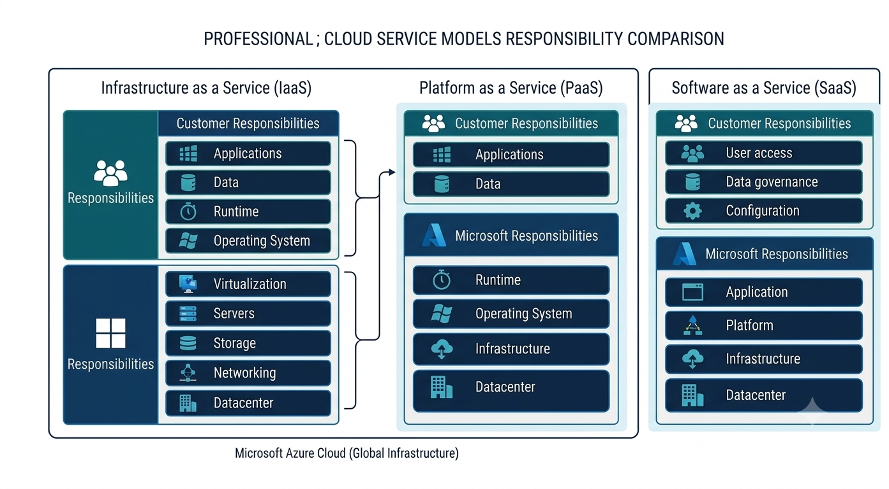

# Lab 03: Cloud Service Models (IaaS, PaaS, SaaS)

## Module

Module 1 — Cloud Concepts

## Lab Overview

This lab explores the three primary cloud service models:

- Infrastructure as a Service (IaaS)
- Platform as a Service (PaaS)
- Software as a Service (SaaS)

Cloud service models determine the level of responsibility shared between the cloud provider and the customer.

Understanding these models helps organizations select the appropriate Azure services based on operational requirements, security responsibilities, and business objectives.

## Learning Objectives

By completing this lab, you will understand:

- Differences between IaaS, PaaS, and SaaS
- Customer responsibilities in each service model
- Microsoft Azure examples for each model
- How service models impact security and administration decisions

## Architecture Overview

Cloud service models represent different levels of abstraction provided by cloud platforms.

As organizations move from IaaS to SaaS:

- Customer management responsibilities decrease
- Cloud provider responsibilities increase
- Operational complexity decreases

The following diagram illustrates the responsibility differences between IaaS, PaaS, and SaaS:

## Services Used

Examples of Microsoft Azure services:

### Infrastructure as a Service (IaaS)

Examples:

- Azure Virtual Machines
- Azure Virtual Networks
- Azure Managed Disks

### Platform as a Service (PaaS)

Examples:

- Azure App Service
- Azure SQL Database
- Azure Functions

### Software as a Service (SaaS)

Examples:

- Microsoft 365
- Microsoft Teams
- Exchange Online

## Implementation Steps

### Step 1 — Infrastructure as a Service (IaaS)

IaaS provides customers with virtualized infrastructure.

The customer manages:

- Operating system
- Applications
- Runtime configuration
- Data
- Identity and access

Azure example:

Azure Virtual Machine

Common use cases:

- Migrating existing applications
- Custom workloads
- Lift-and-shift migrations

---

### Step 2 — Platform as a Service (PaaS)

PaaS provides a managed application platform.

Microsoft manages:

- Infrastructure
- Operating system
- Runtime environment

Customers manage:

- Application code
- Data
- Application configuration

Azure examples:

- Azure App Service
- Azure SQL Database

Common use cases:

- Application development
- Web applications
- API hosting

---

### Step 3 — Software as a Service (SaaS)

SaaS provides complete software solutions.

The cloud provider manages:

- Infrastructure
- Platform
- Application

Customers manage:

- User access
- Data governance
- Configuration

Azure examples:

- Microsoft 365
- Teams
- Exchange Online

Common use cases:

- Business productivity
- Collaboration
- Enterprise applications

## Verification

Confirm understanding by explaining:

- Which model provides the highest customer control
- Which model requires the least infrastructure management
- How security responsibilities change between models

## Security Considerations

Security responsibilities change depending on the service model.

IaaS requires customers to manage:

- Operating system security
- Patch management
- Network security
- Identity controls

PaaS reduces infrastructure responsibilities but requires:

- Secure application development
- Data protection
- Access management

SaaS requires focus on:

- Identity security
- Conditional Access
- Data governance
- User permissions

## Cost Considerations

Different service models affect operational costs.

IaaS:

- Higher management responsibility
- Higher operational overhead

PaaS:

- Reduced infrastructure management
- Faster application deployment

SaaS:

- Subscription-based consumption
- Minimal infrastructure management

Organizations should choose services based on business requirements, security needs, and operational capability.

## Key Takeaways

Cloud service models determine the balance between customer control and cloud provider management.

Understanding IaaS, PaaS, and SaaS is essential for designing secure, cost-effective Azure solutions.

## References

Microsoft Azure Cloud Service Models:

