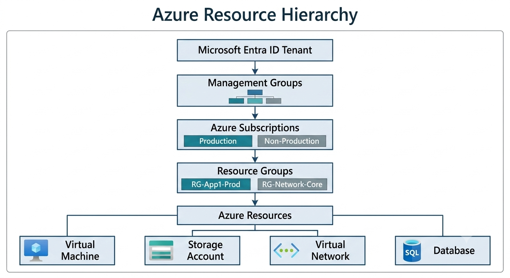

# Lab 01: Azure Resource Hierarchy

## Module

Module 2 — Azure Architecture

## Lab Overview

This lab explores the Microsoft Azure resource hierarchy and explains how Azure organizes resources for management, security, governance, and billing.

Azure environments are structured using multiple levels that allow organizations to apply permissions, policies, and administrative controls at scale.

Understanding Azure hierarchy is essential for designing enterprise Azure environments.

## Learning Objectives

By completing this lab, you will understand:

- Microsoft Entra ID tenant structure
- Management groups
- Azure subscriptions
- Resource groups
- Azure resources
- How governance is applied across Azure environments

## Architecture Overview

Azure resources are organized using a hierarchical model.

The hierarchy begins with the Microsoft Entra ID tenant, which represents the organization's identity boundary.

Below the tenant are management groups, subscriptions, resource groups, and individual Azure resources.

The hierarchy enables organizations to control:

- Access
- Security policies
- Compliance requirements
- Billing boundaries

The following diagram illustrates the Azure resource hierarchy:

## Services Used

Azure concepts:

- Microsoft Entra ID
- Azure Management Groups
- Azure Subscriptions
- Azure Resource Groups
- Azure Resources

## Implementation Steps

## Step 1 — Microsoft Entra ID Tenant

The tenant represents the organization's identity boundary in Azure.

It contains:

- Users
- Groups
- Applications
- Identity configurations

## Step 2 — Management Groups

Management groups provide a governance layer above subscriptions.

Organizations use them to apply:

- Azure Policies
- Role assignments
- Compliance controls

## Step 3 — Subscriptions

Subscriptions provide:

- Billing boundaries
- Access boundaries
- Resource management containers

Organizations may create separate subscriptions for:

- Production
- Development
- Testing

## Step 4 — Resource Groups

Resource groups organize related Azure resources.

Example:

A web application may contain:

- Virtual machine
- Database
- Storage account
- Network components

## Step 5 — Azure Resources

Resources are the individual services deployed inside Azure.

Examples:

- Virtual Machines
- Storage Accounts
- Virtual Networks

## Verification

Confirm understanding by explaining:

- The difference between a subscription and resource group
- Why enterprises use management groups
- How hierarchy supports governance

## Security Considerations

Azure hierarchy supports security through:

- Role-Based Access Control (RBAC)
- Azure Policy
- Resource organization
- Separation of environments

Proper hierarchy design reduces security risk by preventing excessive access.

## Cost Considerations

Azure hierarchy helps organizations control costs through:

- Subscription-level billing
- Resource organization
- Cost analysis
- Department-based allocation

## Key Takeaways

Azure resource hierarchy provides the foundation for enterprise cloud governance.

A well-designed hierarchy improves:

- Security
- Compliance
- Cost management
- Operational efficiency

## References

Microsoft Azure Management Groups:

https://learn.microsoft.com/azure/governance/management-groups/

Azure Resource Hierarchy:

https://learn.microsoft.com/azure/cloud-adoption-framework/ready/landing-zone/resource-consistency
