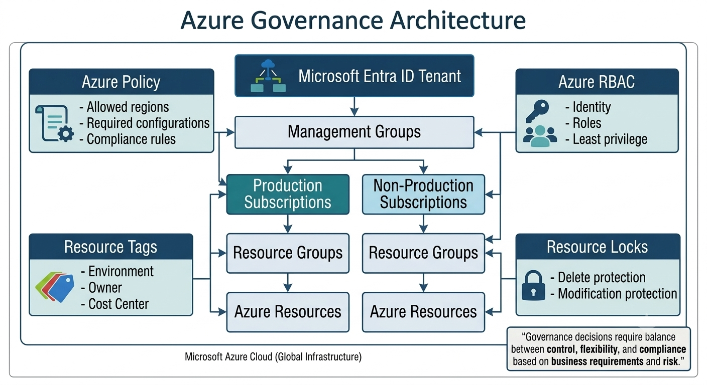

# Lab 03: Azure Governance Architecture

## Module

Module 2 — Azure Architecture

## Lab Overview

This lab explores how organizations establish governance across Azure environments.

Azure governance provides the controls required to manage resources consistently while allowing application teams to operate within defined boundaries.

Governance can address:

- Security
- Compliance
- Resource organization
- Access control
- Cost management
- Resource configuration

The objective is not to prevent teams from using Azure, but to establish appropriate guardrails around how Azure resources are deployed and managed.

## Learning Objectives

By completing this lab, you will understand:

- The purpose of Azure governance
- How management groups support governance at scale
- How Azure Policy establishes resource guardrails
- How Azure RBAC controls access
- How resource tags support organization and cost management
- How resource locks protect critical resources
- Why governance should be designed according to organizational requirements

## Architecture Overview

Enterprise Azure governance operates across multiple scopes.

Management groups can organize subscriptions and provide a scope for policy and governance requirements.

Azure Policy can enforce or audit resource configurations.

Azure RBAC controls who can perform actions on Azure resources.

Resource tags provide metadata for organization, ownership, environment, and cost allocation.

Resource locks provide an additional protection mechanism for critical resources.

The following diagram illustrates a conceptual Azure governance architecture:

## Governance Layers

### Management Groups

Management groups provide an organizational layer above subscriptions.

They can be used to apply governance requirements consistently across multiple subscriptions.

Management groups should be designed around governance requirements rather than creating unnecessarily deep organizational structures.

### Azure Policy

Azure Policy evaluates resources against organizational requirements.

Policies can be used to:

- Audit configurations
- Deny non-compliant deployments
- Require specific configurations
- Enforce organizational standards

### Azure RBAC

Azure Role-Based Access Control determines what authenticated identities can do within a defined Azure scope.

RBAC supports the principle of least privilege by assigning only the permissions required for a user's role.

### Resource Tags

Tags provide metadata that can help organizations identify and organize resources.

Common tags include:

- Environment
- Application
- Owner
- CostCenter
- Department

### Resource Locks

Resource locks can help protect important resources from accidental deletion or modification.

Locks should be used deliberately because they can affect administrative operations.

## Governance Design Example

A simplified enterprise governance model could look like:

Management Group

    |
    +-- Production Subscriptions
    |
    +-- Non-Production Subscriptions
    |
    +-- Sandbox Subscriptions

Governance controls are then applied at appropriate scopes.

For example:

- Management group → organization-wide policy
- Subscription → workload or environment-specific governance
- Resource group → workload-specific organization
- Resource → individual access and configuration

## Implementation Steps

### Step 1 — Identify Governance Requirements

Determine organizational requirements for:

- Security
- Compliance
- Resource locations
- Naming
- Tagging
- Access
- Cost management

### Step 2 — Define Governance Scope

Determine where each control should be applied.

Possible scopes include:

- Management group
- Subscription
- Resource group
- Resource

### Step 3 — Define Policy Controls

Identify Azure Policy requirements such as:

- Allowed regions
- Required tags
- Approved resource types
- Security configuration requirements

### Step 4 — Define Access Controls

Determine which teams require access and assign appropriate Azure RBAC roles.

Access should follow least-privilege principles.

### Step 5 — Protect Critical Resources

Identify resources that require additional protection and evaluate whether resource locks are appropriate.

## Verification

Confirm understanding by explaining:

- Why governance should be applied at appropriate scopes
- How Azure Policy differs from Azure RBAC
- How tags support resource management
- Why resource locks should not replace proper access control

## Security Considerations

Governance is a major component of cloud security.

Organizations should:

- Apply least privilege
- Restrict unauthorized resource configurations
- Monitor policy compliance
- Protect critical resources
- Review privileged access regularly

Governance controls should be designed carefully to avoid creating excessive permissions or unnecessary operational restrictions.

## Cost Considerations

Governance can improve cost visibility and control.

Organizations can use:

- Tags
- Subscription boundaries
- Azure budgets
- Cost analysis
- Policy controls

Cost governance should support accountability without unnecessarily restricting legitimate workloads.

## Key Takeaways

Azure governance provides guardrails that help organizations operate Azure securely and consistently.

A mature governance architecture combines:

- Management groups
- Azure Policy
- Azure RBAC
- Resource tags
- Resource locks

Governance should be designed according to business, security, compliance, and operational requirements.

## References

Azure Management Groups:

https://learn.microsoft.com/azure/governance/management-groups/

Azure Policy:

https://learn.microsoft.com/azure/governance/policy/

Azure Role-Based Access Control:

https://learn.microsoft.com/azure/role-based-access-control/

Azure Resource Locks:

https://learn.microsoft.com/azure/azure-resource-manager/management/lock-resources
