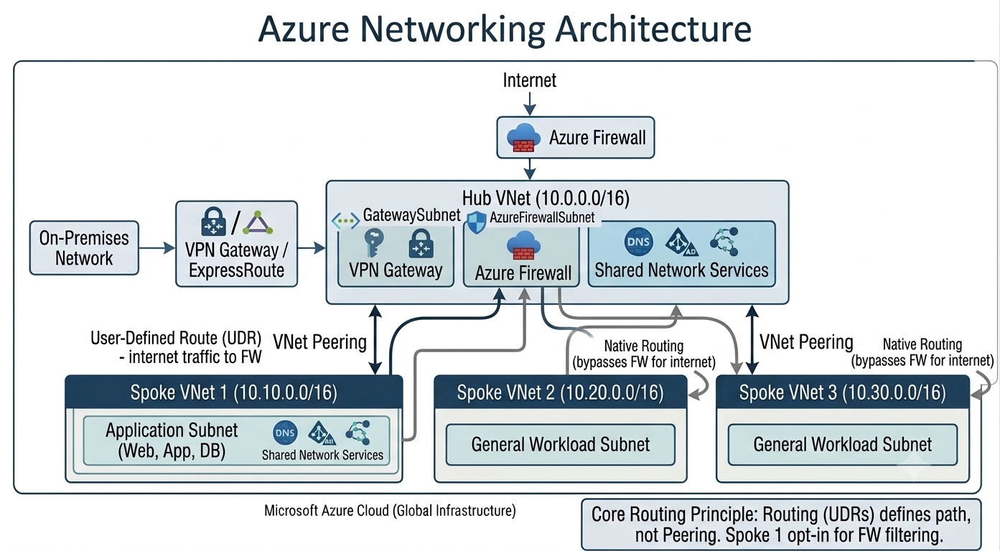

# Lab 04: Azure Networking Architecture

## Module
Module 2 — Azure Architecture

## Lab Overview
This lab explores the architectural principles used to design enterprise-grade networking environments in Microsoft Azure, using a hub-and-spoke topology as the reference model.

Azure networking provides the connectivity layer that allows applications, users, services, and on-premises environments to communicate securely. This is a **design lab**: no Azure resources were deployed. The goal is to demonstrate the ability to architect a secure, scalable network topology and reason about traffic flow, segmentation, and routing before implementation — a core skill for Azure Administrator and Security Engineer roles, where architecture review often precedes deployment.

## Learning Objectives
By completing this lab, you will understand:
- The purpose of a hub-and-spoke Azure Virtual Network topology
- How VNet peering connects hub and spoke networks
- How Azure Firewall provides centralized traffic inspection
- The difference between forced tunneling (via UDR) and native/direct routing
- Why address space planning matters when multiple VNets will peer
- How hybrid connectivity (VPN Gateway / ExpressRoute) integrates into the hub
- The role of shared services (DNS, AD) centralized in the hub

## Architecture Overview
The design centers on a **Hub VNet (`10.0.0.0/16`)** containing shared infrastructure: a `GatewaySubnet` for hybrid connectivity, an `AzureFirewallSubnet` hosting Azure Firewall, and shared network services (DNS, AD).

Three **Spoke VNets** peer with the hub:
- **Spoke VNet 1 (`10.10.0.0/16`)** — hosts the application tier (web, app, database subnets). This spoke uses a **User-Defined Route (UDR)** to force all internet-bound traffic through the hub's Azure Firewall for inspection.
- **Spoke VNet 2 (`10.20.0.0/16`)** and **Spoke VNet 3 (`10.30.0.0/16`)** — general workload subnets that route directly to the internet (native routing), bypassing the firewall.

An on-premises network connects into the hub via VPN Gateway or ExpressRoute, landing in the `GatewaySubnet`.

**Core routing principle:** in Azure, VNet peering provides *connectivity*, but User-Defined Routes determine the actual *traffic path*. Peering alone does not force traffic through the firewall — each spoke must explicitly opt in via UDR if firewall inspection is required. This is a common point of confusion (and a common misconfiguration) in real hub-spoke deployments — it's the key design insight this lab demonstrates.



## Services Used
- Azure Virtual Network (Hub + 3 Spokes)
- Azure Subnets (GatewaySubnet, AzureFirewallSubnet, workload subnets)
- Azure Firewall
- Azure VPN Gateway / ExpressRoute
- VNet Peering
- User-Defined Routes (UDR)
- Network Security Groups (implied at subnet level, not detailed in this conceptual pass)

## Design Steps

**Step 1 — Define the Hub VNet**
The hub is the shared backbone of the topology and is defined first.
```
Hub VNet: 10.0.0.0/16
├── GatewaySubnet        (VPN Gateway / ExpressRoute)
├── AzureFirewallSubnet  (Azure Firewall)
└── Shared Services subnet (DNS, AD)
```

**Step 2 — Define Spoke VNets with non-overlapping address space**
Each spoke must use a CIDR range that does not overlap with the hub or any other spoke, since overlapping ranges cannot be peered.
```
Spoke VNet 1: 10.10.0.0/16  (Application: Web, App, DB)
Spoke VNet 2: 10.20.0.0/16  (General workload)
Spoke VNet 3: 10.30.0.0/16  (General workload)
```

**Step 3 — Establish VNet Peering**
Each spoke peers directly with the hub (spoke-to-spoke traffic, if needed, would route through the hub — not modeled in this lab).

**Step 4 — Define routing behavior per spoke**
- Spoke 1: UDR sends `0.0.0.0/0` traffic to the Azure Firewall's private IP in the hub — all internet traffic is inspected.
- Spokes 2 & 3: no UDR applied — traffic routes natively to the internet, bypassing the firewall. (A deliberate trade-off, noted below under Security Considerations.)

**Step 5 — Plan hybrid connectivity**
On-premises network connects via VPN Gateway or ExpressRoute into the hub's `GatewaySubnet`, giving on-prem systems a single, centrally-secured path into Azure.

## Verification
As a design-stage lab, "verification" here means a peer/self architecture review rather than testing deployed infrastructure:
- Confirmed no CIDR overlap exists between hub and any spoke (validated the four ranges above)
- Confirmed every spoke has an explicit route decision (inspected vs. native) rather than an implicit default
- Confirmed the hub contains only shared/transit infrastructure, not application workloads — keeping the hub thin is a hub-spoke best practice
- Diagram cross-checked against Microsoft's reference hub-spoke architecture for consistency

## Security Considerations
- Centralizing Azure Firewall in the hub gives one enforcement point for traffic leaving Spoke 1, rather than per-VNet firewall appliances
- Spokes 2 and 3 bypassing the firewall is a **known risk accepted in this design**, not an oversight — in a real environment this trade-off would need to be justified (e.g., cost, latency-sensitive workloads) and documented, or closed by extending the UDR to all spokes
- `AzureFirewallSubnet` and `GatewaySubnet` must be exact reserved subnet names — Azure requires these specific names for the respective services to deploy into them
- In a full implementation, NSGs would be applied at each workload subnet as a second layer of defense behind the firewall (defense in depth), not relied on as the only control

## Cost Considerations
- Azure Firewall and VPN Gateway are the two most expensive fixed-cost components in this topology — both bill hourly regardless of traffic volume, so centralizing them in the hub (rather than duplicating per spoke) is also a cost optimization, not just a security one
- VNet peering itself has a low per-GB data transfer cost but no hourly charge
- Spokes 2 and 3 avoiding forced tunneling also avoids extra data processing charges through the firewall — a secondary reason that trade-off might be made deliberately

## Key Takeaways
- Hub-and-spoke centralizes shared services and security enforcement, reducing duplication across workloads
- Peering enables connectivity; routing (UDRs) determines the actual traffic path — these are separate concerns and both must be configured deliberately
- Every spoke's routing decision (inspected vs. native) should be a documented, intentional choice, not a default
- Address planning must happen before peering — overlapping ranges block the design entirely

## References
- [Microsoft Learn: Hub-spoke network topology in Azure](https://learn.microsoft.com/en-us/azure/architecture/networking/architecture/hub-spoke)
- [Microsoft Learn: Azure Firewall documentation](https://learn.microsoft.com/en-us/azure/firewall/overview)
- [Microsoft Learn: Virtual network peering](https://learn.microsoft.com/en-us/azure/virtual-network/virtual-network-peering-overview)
- [Microsoft Learn: User-defined routes](https://learn.microsoft.com/en-us/azure/virtual-network/virtual-networks-udr-overview)
