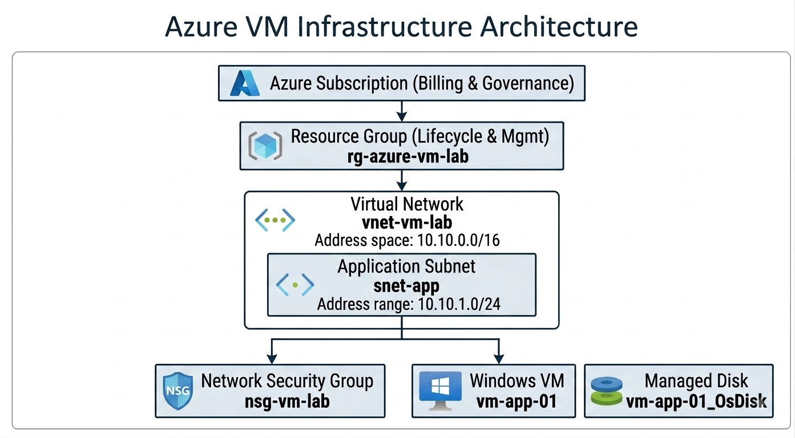

# Lab 01 — Azure Virtual Machines

## Overview

This lab demonstrates the deployment and architectural configuration of an Ubuntu-based Azure Virtual Machine within a controlled Azure network environment.

The lab focuses on understanding how Azure Virtual Machines are designed, deployed, secured, networked, and validated using supporting Azure resources.

The objective is not simply to deploy a virtual machine, but to demonstrate the architectural decisions involved in designing a secure and manageable Infrastructure-as-a-Service (IaaS) workload in Microsoft Azure.
---

## Business Scenario

A small organization needs a Linux-based application server in Azure. The workload requires OS-level control, custom software installation, persistent storage, and controlled administrative access.

---

## Objectives

By completing this lab, I demonstrated how to:

* Deploy an Azure Virtual Machine.
* Create a dedicated virtual network and subnet.
* Configure network security using a Network Security Group.
* Configure secure SSH administrative access.
* Validate network connectivity from the virtual machine.
* Document the architectural decisions made during deployment.
* Evaluate security, networking, availability, scalability, and cost considerations.

---

## Target Architecture

The solution will use the following logical architecture:

## Azure Resources

| Resource | Name | Configuration / Purpose |
|---|---|---|
| Resource Group | `rg-azure-vm-lab` | Logical management boundary for the lab resources |
| Virtual Network | `vnet-vm-lab` | `10.10.0.0/16` network boundary |
| Subnet | `snet-app` | `10.10.1.0/24` subnet hosting the VM |
| Network Security Group | `nsg-vm-lab` | Controls inbound and outbound network traffic |
| Virtual Machine | `vm-app-01` | Ubuntu-based IaaS compute workload |
| Operating System | Ubuntu Server 24.04.4 LTS | Linux operating system for the VM |
| Private IP | `10.10.1.4` | Private address assigned to the VM |

## Virtual Machine Configuration

| Setting | Configuration |
|---|---|
| VM name | `vm-app-01` |
| Operating system | Ubuntu Server 24.04.4 LTS |
| Architecture | x64 |
| Authentication | SSH public key |
| Administrator | `azureadmin` |
| Private IP | `10.10.1.4` |
| Subnet | `snet-app` |
| VNet | `vnet-vm-lab` |
| VM size | Standard_B2s |

## Architectural Considerations

The architecture will consider the following:

### Security

The VM is protected using a Network Security Group associated with the application subnet.

The NSG is:

`nsg-vm-lab`

SSH administrative access is restricted using the following custom inbound rule:

| Setting | Configuration |
|---|---|
| Rule name | `Allow-SSH-MyIP` |
| Priority | `100` |
| Source | Administrator public IP |
| Source CIDR | `/32` |
| Destination | Any |
| Destination port | `22` |
| Protocol | TCP |
| Action | Allow |

The `/32` CIDR restricts SSH access to a single source IPv4 address rather than allowing SSH access from the entire internet.

SSH authentication uses an SSH public/private key pair rather than password authentication.

### Networking

The virtual network will use:

* Address space: `10.10.0.0/16`
* Application subnet: `10.10.1.0/24`
* Network Security Group: `nsg-vm-lab`

### Compute

The VM will be selected based on the requirements of the workload rather than simply choosing the largest available size.

### Storage

Azure Managed Disks will provide persistent storage for the virtual machine.

### Cost

The VM size, disk configuration, and runtime duration will be considered as part of the overall cost of the solution.

---

## Implementation

The lab was implemented in the following stages:

1. Created the resource group `rg-azure-vm-lab`.
2. Created the virtual network `vnet-vm-lab` with address space `10.10.0.0/16`.
3. Created the `snet-app` subnet using `10.10.1.0/24`.
4. Created and associated the `nsg-vm-lab` Network Security Group with the subnet.
5. Deployed the `vm-app-01` Ubuntu Server 24.04.4 LTS virtual machine.
6. Configured SSH public-key authentication.
7. Assigned a temporary Azure Public IP for administrative access.
8. Restricted SSH access to the administrator's public IP using an NSG `/32` rule.
9. Connected to the VM successfully using SSH from PowerShell.
10. Validated the VM's operating system, hostname, private IP address, and network interface.
11. Validated outbound connectivity using ICMP and HTTPS.

---

## Validation

The deployed VM was validated from an SSH session.

### Operating System

The VM was confirmed to be running:

`Ubuntu 24.04.4 LTS`

### Hostname

The VM hostname was confirmed as:

`vm-app-01`

### Private IP Address

The VM was assigned:

`10.10.1.4`

The address belongs to the configured application subnet:

`10.10.1.0/24`

### Network Interface

The `eth0` interface was confirmed to be operational with the private address `10.10.1.4/24`.

### SSH Connectivity

SSH access from the administrator's workstation was successfully established using SSH public-key authentication.

### Outbound Connectivity

ICMP connectivity was tested using:

`ping -c 4 8.8.8.8`

Result:

* 4 packets transmitted
* 4 packets received
* 0% packet loss

HTTPS connectivity was tested using:

`curl -I https://www.microsoft.com`

Result:

`HTTP/2 200`

These tests confirmed that the VM has functional outbound network connectivity.

---

## Evidence

## Evidence

Evidence collected during the implementation includes:

* Azure resource group configuration
* Virtual network and subnet configuration
* Network Security Group configuration
* VM configuration
* VM networking configuration
* SSH security rule
* Successful SSH connection
* Ubuntu operating system verification
* Private IP verification
* Outbound connectivity tests
* Azure VM architecture diagram

Screenshots and the final architecture diagram are stored in the `Diagrams` directory and referenced from this README where appropriate.

---

## Architecture Decisions

| Decision | Rationale |
|---|---|
| Use Azure VM | The workload requires operating-system-level control and the ability to install and manage custom software. |
| Dedicated VNet | Provides an isolated network boundary for the workload. |
| `snet-app` subnet | Provides a dedicated network segment for the application VM. |
| NSG at subnet level | Centralizes network access control for resources deployed in the subnet. |
| SSH public-key authentication | Provides stronger administrative authentication than password-based access. |
| Restrict SSH to administrator IP | Reduces exposure of the SSH management interface. |
| Temporary Public IP | Provides administrative SSH connectivity for the lab while keeping the architecture simple. |
| Standard_B2s VM size | Provides a small compute footprint appropriate for a learning environment while controlling cost. |
---

## Lessons Learned

This lab demonstrated several important Azure IaaS and networking concepts.

### 1. Subnets must belong to the VNet address space

The VNet was configured with:

`10.10.0.0/16`

The application subnet:

`10.10.1.0/24`

was therefore valid because it falls within the VNet address space.

### 2. NSGs control network access

The `nsg-vm-lab` Network Security Group was associated with the application subnet and used to control inbound SSH access.

### 3. SSH access should be restricted

Rather than allowing SSH from any source, the custom `Allow-SSH-MyIP` rule restricts TCP port 22 to a single administrator IP using a `/32` CIDR.

### 4. Private and public IP addresses serve different purposes

The VM communicates internally using its private address:

`10.10.1.4`

A public IP was used to provide temporary external SSH access to the VM.

### 5. IaaS requires operational responsibility

Azure provides the underlying infrastructure, but the VM administrator remains responsible for operating-system configuration, access control, updates, security hardening, monitoring, and cost management.

---

## Conclusion

This lab demonstrates the deployment of an Azure Virtual Machine as an Infrastructure-as-a-Service workload.

The primary architectural lesson is that Azure Virtual Machines provide significant control over the operating system and infrastructure configuration, but that control also introduces additional operational and security responsibilities compared with more managed Azure compute services.

