# Lab 04 — Azure Container Instances (ACI)

## Overview

This lab demonstrates how to deploy and run a containerized application using **Azure Container Instances (ACI)**.

Azure Container Instances provides a simple way to run containers in Azure without having to provision or manage virtual machines.

The lab covers container deployment, networking, application access, container management, monitoring, and Azure CLI validation.

---

## Objectives

By completing this lab, I will:

* Understand the purpose of Azure Container Instances
* Understand the difference between containers and virtual machines
* Create an Azure Container Instance
* Deploy a containerized application
* Configure container networking
* Expose a container application through a public IP address
* Configure a DNS name label
* Access the application from a web browser
* Inspect container properties and configuration
* View container logs
* Manage the container lifecycle
* Validate the deployment using Azure CLI
* Clean up Azure resources after completing the lab

---

## Architecture

The following diagram represents the architecture implemented in this lab:


### Architecture Flow

```text
Internet
   │
   ▼
Public IP / DNS
   │
   ▼
Azure Container Instance
   │
   ▼
Containerized Application
```

The user accesses the application through the public endpoint exposed by the Azure Container Instance.

---

## Prerequisites

* An active Azure subscription
* Access to the Azure Portal
* Basic understanding of Azure resources
* Basic understanding of networking concepts
* Azure CLI access for validation

---

# Step 1 — Create the Resource Group

A dedicated resource group is created to contain the resources used for this lab.

### Configuration

| Setting        | Value              |
| -------------- | ------------------ |
| Resource Group | `rg-aci-lab`       |
| Region         | South Africa North |

### Screenshot

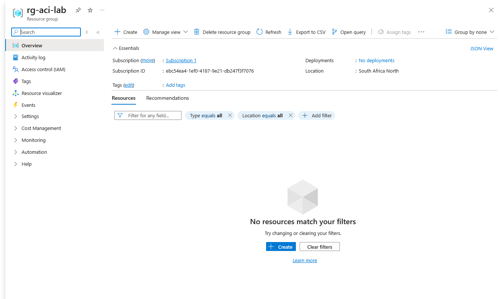

---

# Step 2 — Create the Azure Container Instance

Navigate to:

**Azure Portal → Container Instances → Create**

The container instance will host the containerized application.

### Configuration

| Setting          | Value                                        |
| ---------------- | -------------------------------------------- |
| Resource Group   | `rg-aci-lab`                                 |
| Container Name   | `aci-app-lab`                                |
| Region           | South Africa North                           |
| Operating System | Linux                                        |
| Image Source     | Quickstart image                             |
| Image            | `mcr.microsoft.com/azuredocs/aci-helloworld` |

### Screenshot

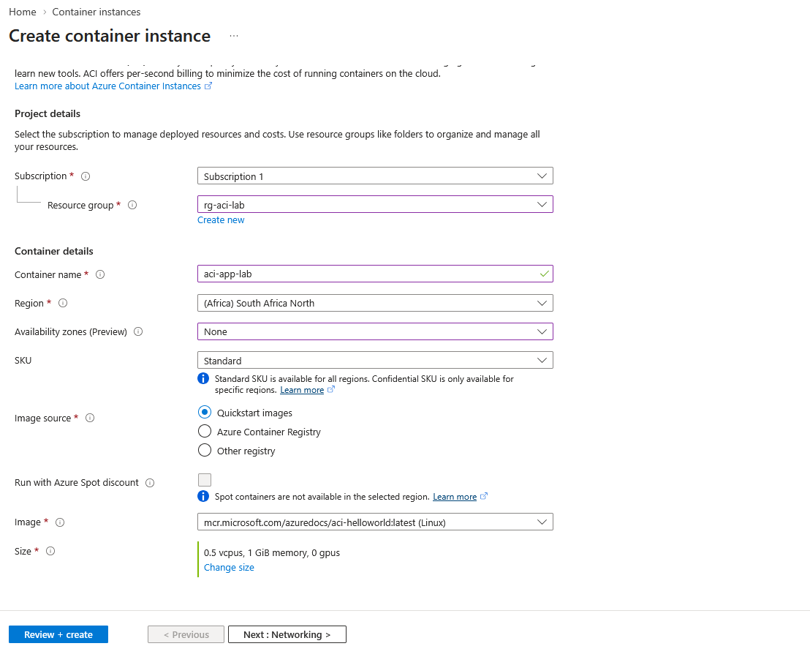

---

# Step 3 — Configure Container Networking

Configure the container to accept HTTP traffic.

### Configuration

| Setting         | Value            |
| --------------- | ---------------- |
| DNS Name Label  | Unique DNS label |
| Port            | 80               |
| Protocol        | TCP              |
| IP Address Type | Public           |

### Screenshot

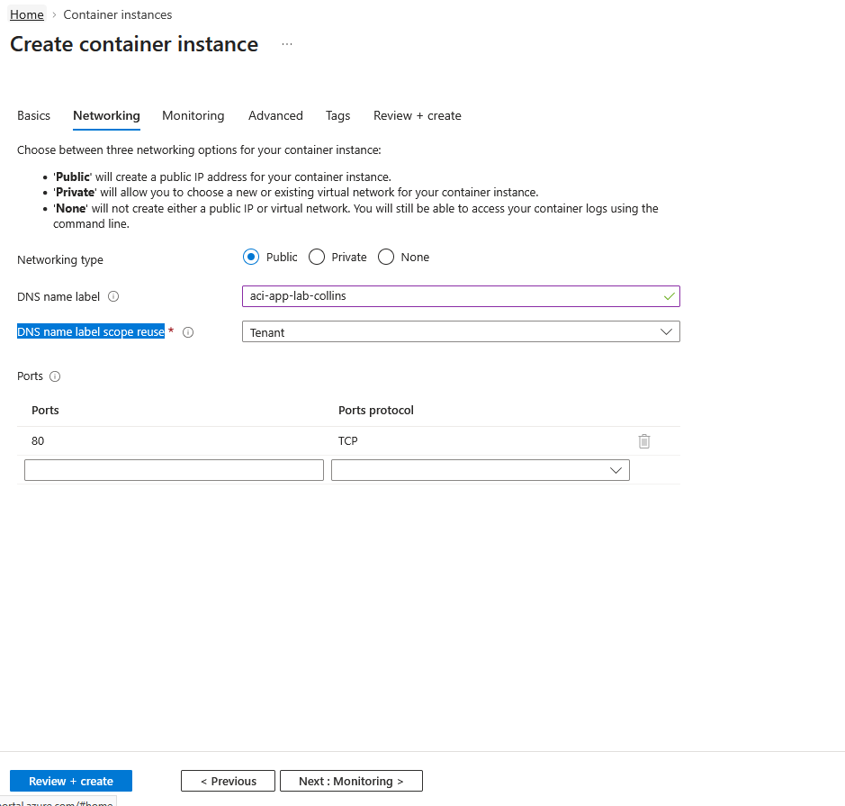

---

# Step 4 — Deploy the Container

Review the configuration and deploy the container instance.

After deployment, verify that the deployment completes successfully.

### Screenshot

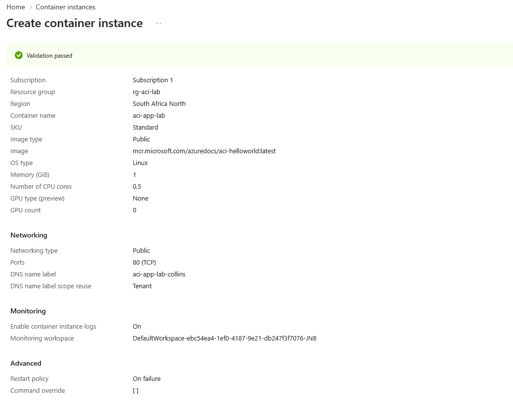

---

# Step 5 — Verify the Container Instance

Open the deployed container instance and verify:

* Provisioning state
* Container state
* IP address
* FQDN
* Operating system
* Image
* Port configuration

### Screenshot

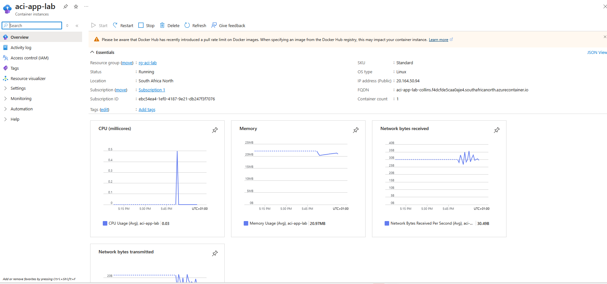

---

# Step 6 — Test the Application

Open the public FQDN or IP address in a web browser.

The containerized application should load successfully.

### Expected Result

The Azure Container Instances sample application should be displayed in the browser.

### Screenshot

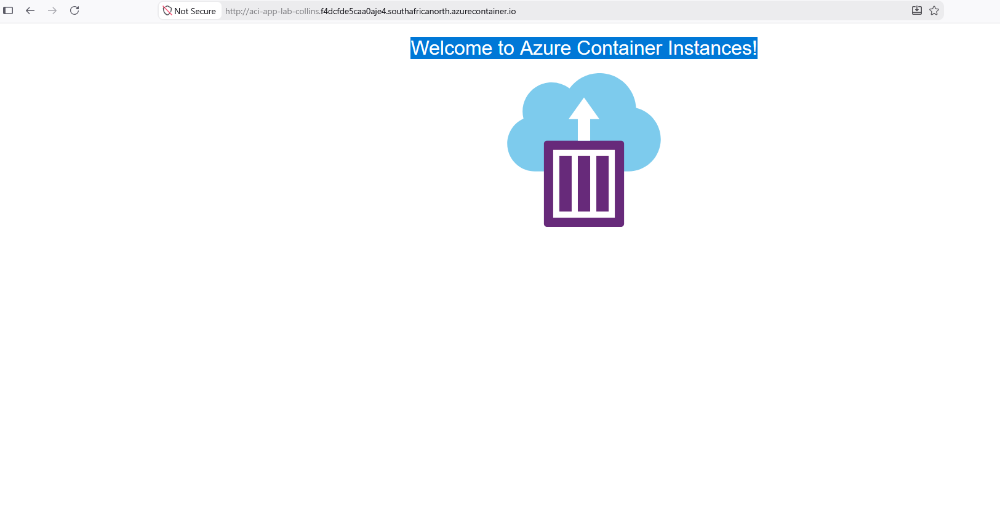

---

# Step 7 — Inspect Container Logs

Navigate to the container's **Logs** section.

Review the logs generated by the running container.

This demonstrates how application output can be inspected when troubleshooting a containerized workload.

### Screenshot

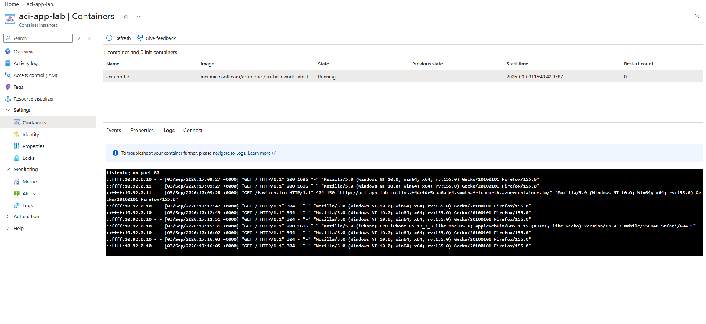

---

# Step 8 — Inspect Container Configuration

Review the container's configuration and identify:

* CPU allocation
* Memory allocation
* Image
* Ports
* Environment configuration
* Restart policy
* Network configuration

### Screenshot

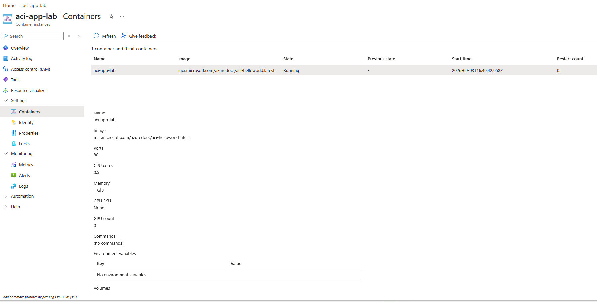

---

# Step 9 — Manage the Container Lifecycle

Test basic container lifecycle operations.

Examples include:

* Restarting the container
* Stopping the container
* Starting the container again

Observe the changes in the container's state.

### Screenshot

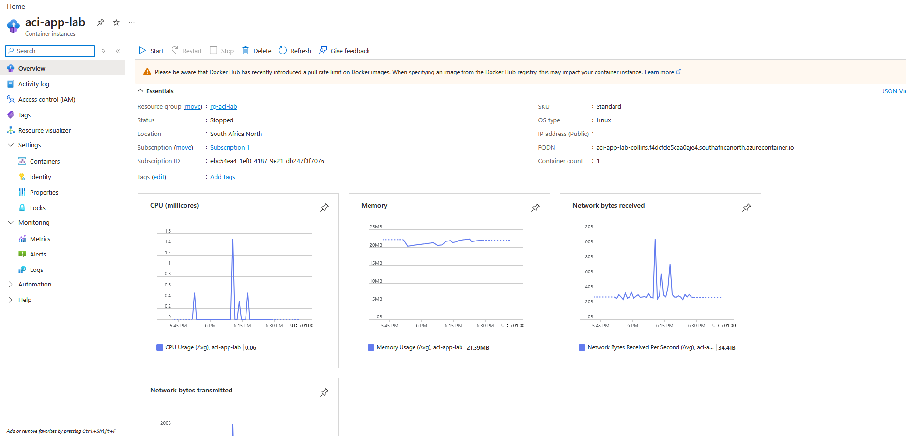

---

# Step 10 — Validate Using Azure CLI

Use Azure CLI to inspect the deployed container instance.

Example commands:

```bash
az container show \
  --resource-group rg-aci-lab \
  --name aci-app-lab
```

Retrieve the container's IP address:

```bash
az container show \
  --resource-group rg-aci-lab \
  --name aci-app-lab \
  --query ipAddress.ip \
  --output tsv
```

Retrieve the fully qualified domain name:

```bash
az container show \
  --resource-group rg-aci-lab \
  --name aci-app-lab \
  --query ipAddress.fqdn \
  --output tsv
```

View container logs:

```bash
az container logs \
  --resource-group rg-aci-lab \
  --name aci-app-lab
```

### Screenshot

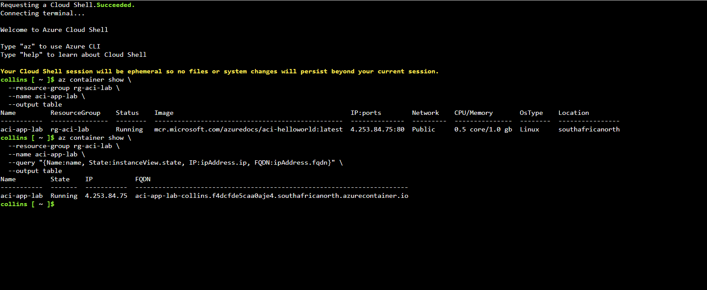

---

# Step 11 — Verify Resource Deployment

Confirm that the resource group contains the expected Azure Container Instance.

### Expected Resource

```text
rg-aci-lab
└── aci-app-lab
```

### Screenshot

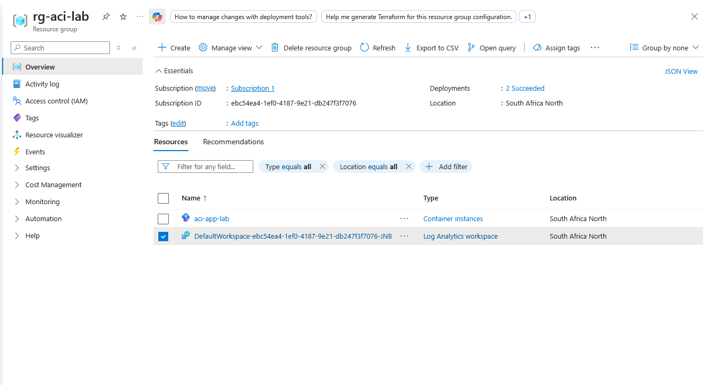

---

# Step 12 — Cleanup

After completing the lab, delete the resource group to prevent unnecessary Azure charges.

Navigate to:

**Azure Portal → Resource Groups → rg-aci-lab → Delete resource group**

Alternatively, use Azure CLI:

```bash
az group delete \
  --name rg-aci-lab \
  --yes \
  --no-wait
```

---

# Validation Checklist

| Task                              | Status |
| --------------------------------- | ------ |
| Resource group created            | ⬜      |
| Container Instance created        | ⬜      |
| Container image deployed          | ⬜      |
| Port 80 configured                | ⬜      |
| Public endpoint configured        | ⬜      |
| Application accessed successfully | ⬜      |
| Container logs reviewed           | ⬜      |
| Container configuration inspected | ⬜      |
| Container lifecycle tested        | ⬜      |
| Azure CLI validation completed    | ⬜      |
| Resources cleaned up              | ⬜      |

---

# Key Concepts Learned

### Azure Container Instances

ACI allows containers to run directly in Azure without requiring the user to manage the underlying virtual machines.

### Container Image

A container image contains the application and the dependencies required to run it.

### Container

A running instance of a container image.

### Container Port

The network port exposed by the application running inside the container.

### Public IP

Allows the containerized application to be accessed from the internet.

### DNS Name Label

Provides a DNS-based endpoint for accessing the container.

---

# VM vs App Service vs Azure Container Instances

| Feature                   | Virtual Machine | App Service           | Container Instances        |
| ------------------------- | --------------- | --------------------- | -------------------------- |
| Infrastructure management | High            | Low                   | Low                        |
| OS management             | Customer        | Microsoft             | Microsoft                  |
| Application deployment    | Manual/varied   | Application-focused   | Container-focused          |
| Container required        | No              | No                    | Yes                        |
| Scaling                   | Manual/VMSS     | Built-in options      | Limited/simple             |
| Best suited for           | Full OS control | Web applications/APIs | Simple container workloads |

---

# Conclusion

This lab demonstrated how to deploy and manage a containerized application using Azure Container Instances.

The lab also demonstrated the progression from traditional virtual machines to managed application platforms and container-based workloads.

The key takeaway is that **ACI abstracts away much of the infrastructure management required by virtual machines**, allowing the focus to remain on running the containerized application.

---

## Lab Status

**Status:** In Progress

**Module:** Module 03 — Azure Compute

**Lab:** Lab 04 — Azure Container Instances

**Platform:** Microsoft Azure

**Region:** South Africa North

**Resource Group:** `rg-aci-lab`

