# Lab 02: Azure Virtual Machine Scale Sets (VMSS)

---

## 1. Overview

Azure Virtual Machine Scale Sets (VMSS) allow you to deploy and manage a group of Azure virtual machines as a single scalable resource.

A VM Scale Set can automatically increase or decrease the number of virtual machine instances based on workload demand.

VMSS provides:

* Automatic scaling
* High availability
* Centralized management
* Load balancing
* Consistent VM configuration
* Improved resource utilization
* Cost optimization

VM Scale Sets are commonly used for:

* Web applications
* API services
* Microservices
* High-traffic applications
* Distributed workloads
* Applications requiring multiple identical VM instances

---

## 2. Lab Objective

By completing this lab, I learned how to:

* Create an Azure Virtual Machine Scale Set
* Configure a Virtual Network and subnet
* Deploy multiple VM instances
* Configure autoscaling
* Configure an Azure Load Balancer
* Understand backend pools
* Configure health probes
* Configure load-balancing rules
* Install and configure Nginx on VMSS instances
* Test traffic distribution between VM instances
* Understand how VMSS improves scalability and availability
* Validate connectivity and outbound internet access

---

# 3. Lab Architecture

The completed environment consists of:

1. Azure Virtual Machine Scale Set
2. Two Ubuntu Linux VM instances
3. Azure Virtual Network
4. Application subnet
5. Azure Load Balancer
6. Public IP address
7. Backend pool
8. Health probe
9. Load-balancing rule
10. Autoscale configuration
11. Nginx web server

### Architecture Flow

```text
                         INTERNET
                            |
                            | HTTP :80
                            v
                 +-----------------------+
                 |   Azure Load Balancer |
                 |      Public IP        |
                 +-----------+-----------+
                             |
                 +-----------+-----------+
                 |                       |
          Health Probe              Load Balancing
          TCP :80                   Rule HTTP :80
                 |                       |
                 +-----------+-----------+
                             |
                       Backend Pool
                             |
                +------------+------------+
                |                         |
                v                         v
        +---------------+         +---------------+
        | VMSS Instance |         | VMSS Instance |
        |       0       |         |       1       |
        |    Nginx      |         |    Nginx      |
        +-------+-------+         +-------+-------+
                |                         |
                +------------+------------+
                             |
                    vnet-vmss-lab
                             |
                         snet-app
```

### Architecture Diagram

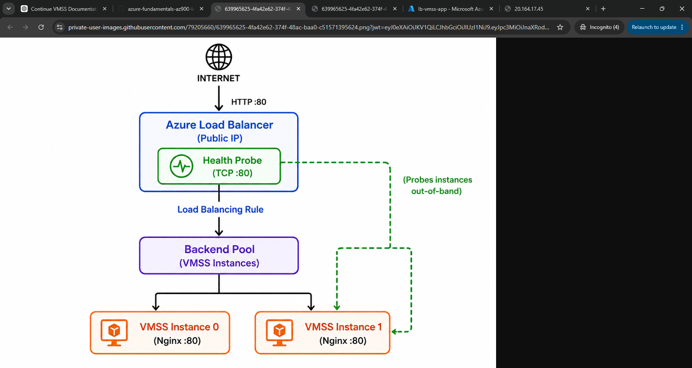

---

# 4. Lab Scenario

A company is hosting a web application that experiences variable traffic.

During normal operating conditions, the application requires a minimum of two virtual machine instances.

When traffic increases, additional instances should be created automatically.

When traffic decreases, unnecessary instances should be removed to reduce resource consumption.

The application also needs a load balancer so that incoming HTTP traffic can be distributed across healthy VM instances.

This lab demonstrates how Azure VMSS, Azure Load Balancer, health probes, and autoscaling work together to provide a scalable application platform.

---

# 5. Resource Configuration

## Resource Group

```text
rg-vmss-lab
```

The resource group contains the resources created for this lab.

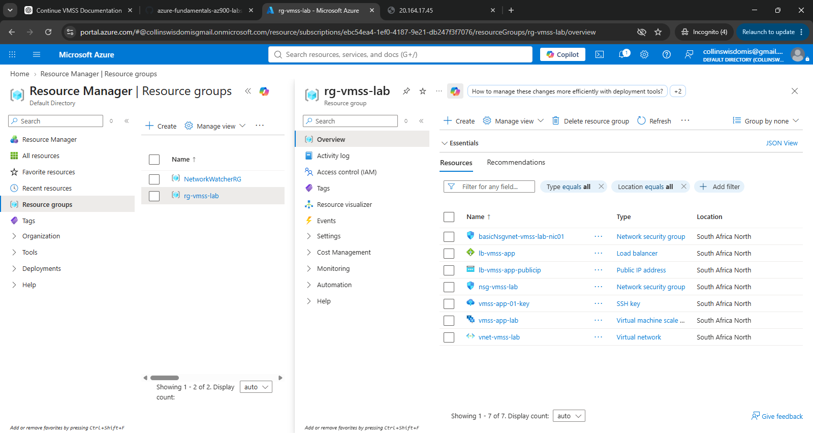

---

## Virtual Machine Scale Set

```text
vmss-app-lab
```

### Configuration

| Setting              | Value                          |
| -------------------- | ------------------------------ |
| VMSS Name            | `vmss-app-lab`                 |
| Operating System     | Ubuntu Server 24.04 LTS - Gen2 |
| VM Size              | Standard DS1 v2                |
| vCPU                 | 1                              |
| Memory               | 3.5 GiB                        |
| Initial Instances    | 2                              |
| Minimum Instances    | 2                              |
| Maximum Instances    | 20                             |
| Autoscaling          | Enabled                        |
| Predictive Autoscale | Disabled                       |

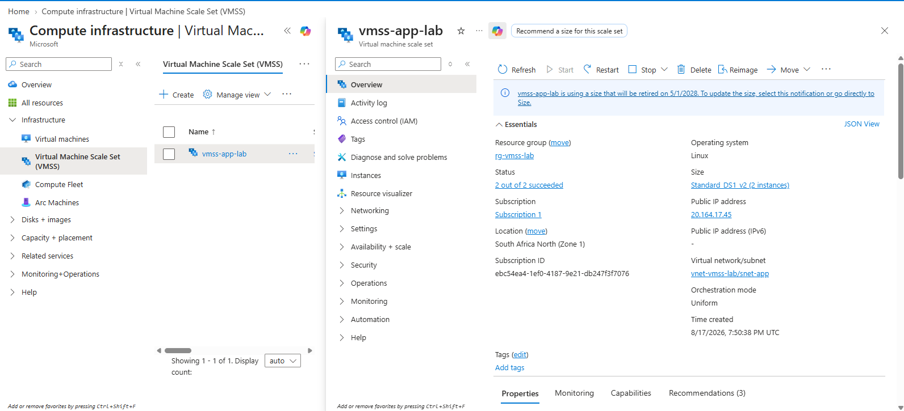

---

# 6. VMSS Instances

The VM Scale Set initially contains two instances.

```text
vmss-app-lab
│
├── Instance 0
└── Instance 1
```

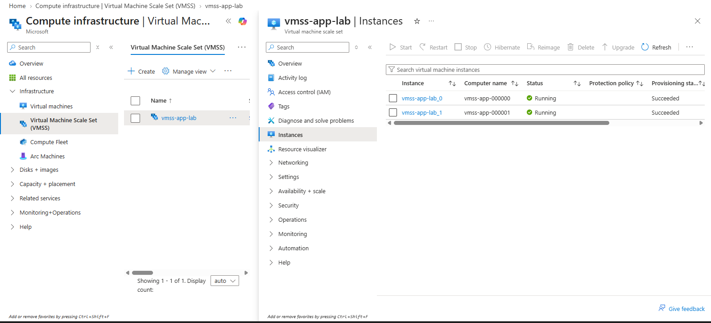

Each instance is independently running the Ubuntu operating system and Nginx web server.

The instances are managed collectively by the VM Scale Set.

---

# 7. Networking

The VMSS is connected to an Azure Virtual Network.

## Virtual Network

```text
vnet-vmss-lab
```

## Subnet

```text
snet-app
```

The subnet provides the network segment where the VMSS instances are deployed.

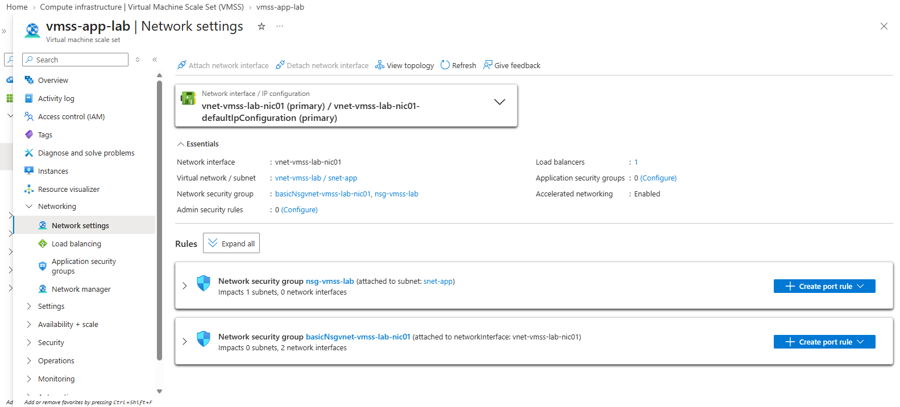

---

# 8. Azure Load Balancer

An Azure Load Balancer was configured to distribute incoming HTTP traffic across the VMSS instances.

## Load Balancer

```text
lb-vmss-app
```

### Configuration

| Setting          | Value                          |
| ---------------- | ------------------------------ |
| Name             | `lb-vmss-app`                  |
| SKU              | Standard                       |
| Frontend         | `lb-vmss-app-frontendconfig01` |
| Public IP        | `lb-vmss-app-publicip`         |
| Backend Pool     | `bepool`                       |
| Protocol         | TCP                            |
| Application Port | 80                             |

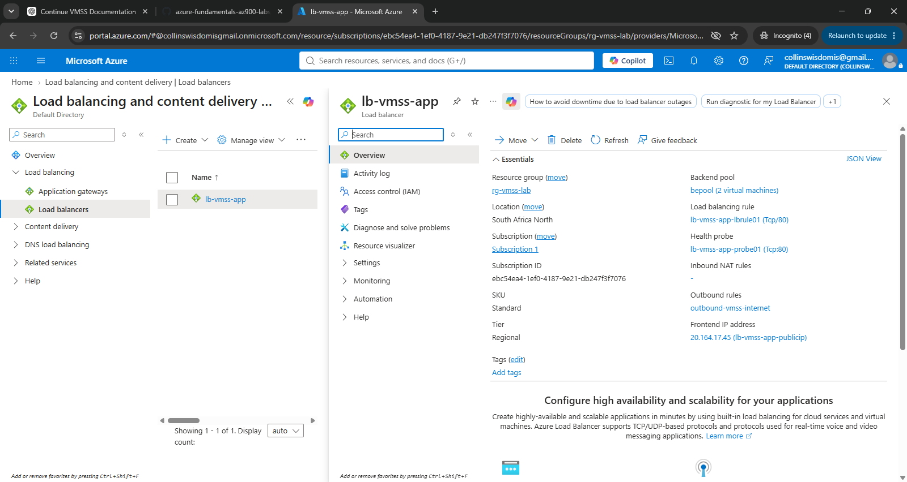

---

# 9. Frontend IP Configuration

The frontend IP represents the public-facing side of the Azure Load Balancer.

Internet clients connect to the public IP address.

```text
Internet
    |
    v
Public IP
    |
    v
Azure Load Balancer
```

The frontend configuration used in this lab is:

```text
lb-vmss-app-frontendconfig01
```

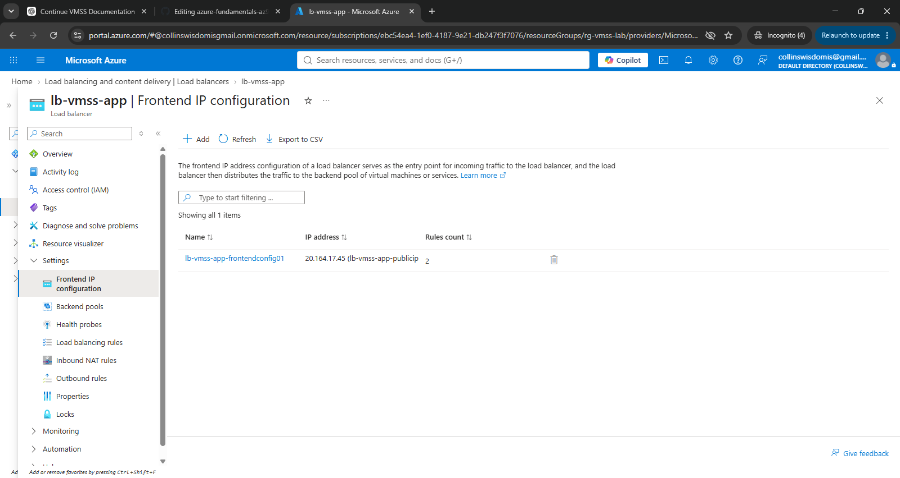

---

# 10. Backend Pool

The backend pool contains the VMSS instances that receive traffic from the Load Balancer.

```text
Azure Load Balancer
        |
        v
   Backend Pool
      bepool
      /    \
     /      \
Instance 0  Instance 1
```

The backend pool allows the Load Balancer to distribute incoming connections between the available VMSS instances.

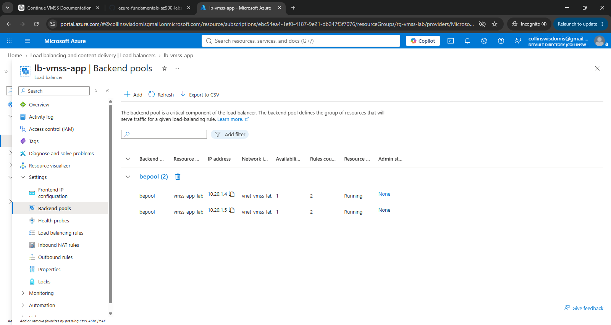

---

# 11. Health Probe

The Load Balancer uses a health probe to determine whether backend instances are available to receive traffic.

The configured probe checks TCP port 80.

```text
Health Probe
     |
     +----> VMSS Instance 0 :80
     |
     +----> VMSS Instance 1 :80
```

If an instance stops responding on the configured probe, the Load Balancer can stop sending new traffic to that instance.

This prevents traffic from being intentionally distributed to an unhealthy backend.

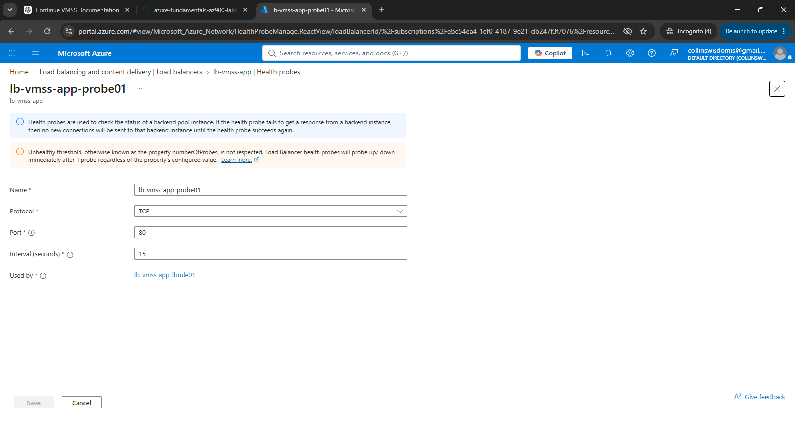

---

# 12. Load-Balancing Rule

The HTTP load-balancing rule connects the public-facing frontend to the backend pool.

### Configuration

```text
Protocol: TCP
Frontend Port: 80
Backend Port: 80
Backend Pool: bepool
Health Probe: HTTP/TCP port 80
```

Traffic flow:

```text
Client
  |
  | HTTP :80
  v
Load Balancer Public IP
  |
  v
Frontend IP
  |
  v
Load Balancing Rule
  |
  v
Backend Pool
  |
  +----------+
  |          |
  v          v
VMSS 0     VMSS 1
  |          |
  +----------+
       |
     Nginx
       |
     :80
```

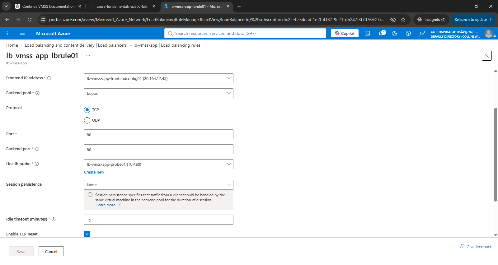

---

# 13. Load Balancer Connection Settings

The Load Balancer was configured with:

```text
Idle timeout: 15 minutes
TCP Reset: Disabled
Floating IP: Disabled
```

The 15-minute idle timeout determines how long an idle connection can remain established before the Load Balancer removes the connection state.

TCP Reset and Floating IP were not enabled for this lab.

---

# 14. Autoscaling

Autoscaling allows the VMSS to automatically adjust the number of instances based on workload conditions.

The VMSS was configured with:

```text
Minimum instances: 2
Maximum instances: 20
Default instances: 2
Predictive autoscale: Disabled
```

The autoscale configuration uses CPU-based scaling.

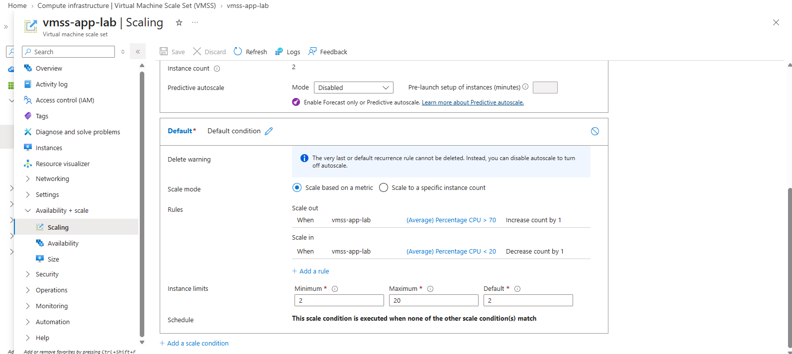

---

# 15. CPU-Based Autoscale

A CPU-based autoscale condition was configured for the VMSS.

The general concept is:

```text
CPU Utilization
       |
       v
Autoscale Evaluation
       |
       +----------------+
       |                |
   High CPU          Low CPU
       |                |
       v                v
Scale Out          Scale In
       |                |
       v                v
More VM Instances   Fewer VM Instances
```

The configured autoscale condition was named:

```text
CPU-Based-Autoscale
```

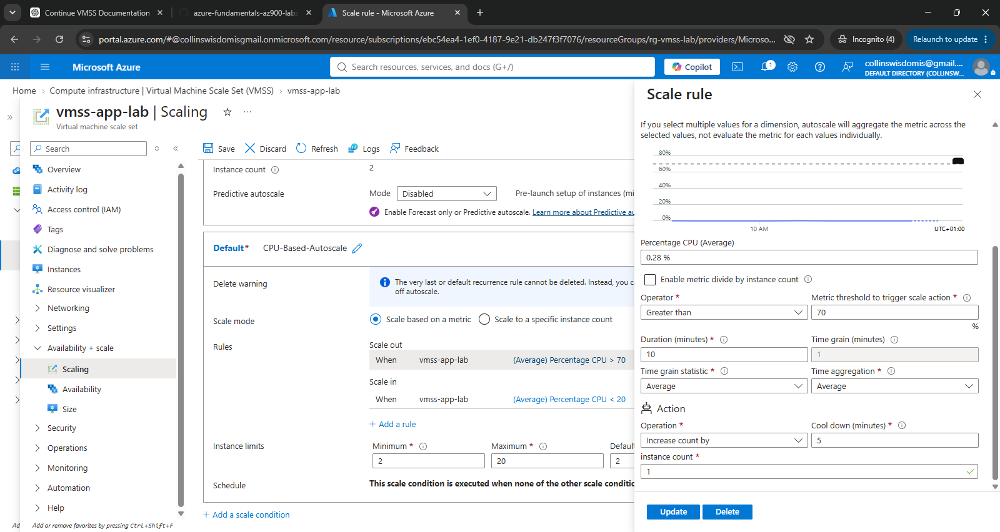

---

# 16. Why the Maximum Instance Count Is 20

The autoscale configuration displayed a maximum instance count of:

```text
20
```

This means the VM Scale Set is permitted to scale out to a maximum of 20 instances under the configured autoscale settings.

The maximum value does **not** mean that 20 VMs are currently running.

The current instance count remained:

```text
2
```

The distinction is:

```text
Minimum = 2
Current  = 2
Maximum  = 20
```

Therefore:

* Azure maintains at least 2 instances.
* The VMSS currently has 2 instances.
* Autoscaling may create additional instances when scaling conditions are met.
* Azure will not exceed the configured maximum of 20 instances.

---

# 17. Nginx Web Server

Nginx was installed on the VMSS instances to provide a simple HTTP web service.

Nginx listens on:

```text
TCP :80
```

This makes it possible to test the Azure Load Balancer by sending HTTP requests to the public IP.

Each VMSS instance was given a distinguishable response so that traffic distribution could be observed.

For example:

```text
VMSS Instance 0
```

and:

```text
VMSS Instance 1
```

This allows us to identify which backend instance responded to each request.

---

# 18. Testing Load Balancer Traffic Distribution

Requests were sent repeatedly to the Load Balancer public IP.

The responses demonstrated that requests could be served by different VMSS instances.

Conceptually:

```text
Request 1
   |
   v
Load Balancer
   |
   v
Instance 0
```

Then:

```text
Request 2
   |
   v
Load Balancer
   |
   v
Instance 1
```

The response from the Nginx test confirmed that traffic was reaching the VMSS backend instances.

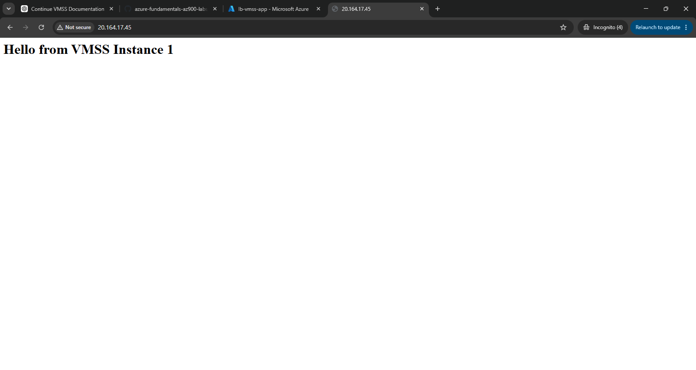

---

# 19. Connectivity Testing

Connectivity was also tested from the VMSS environment.

Internet connectivity was verified using:

```bash
ping 8.8.8.8
```

The web connectivity test was performed using:

```bash
curl https://www.microsoft.com
```

The successful response demonstrated outbound internet connectivity from the VM.


---

# 20. Outbound Connectivity

An outbound rule was also examined/configured for the Load Balancer environment.

The purpose of outbound connectivity is to allow backend instances to establish connections to external destinations when required.

Conceptually:

```text
VMSS Instance
     |
     v
Azure Load Balancer
     |
     v
Outbound Connectivity
     |
     v
Internet
```

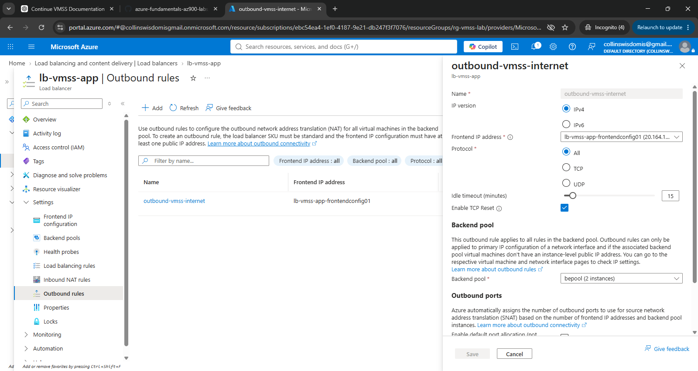

---

# 21. Important VMSS Concepts Learned

## VM Scale Set

A VMSS is a resource that allows Azure to manage multiple identical virtual machine instances as a group.

---

## Instance

An instance is an individual virtual machine within the VM Scale Set.

For this lab:

```text
Instance 0
Instance 1
```

---

## Backend Pool

The backend pool identifies the VM instances that can receive traffic from the Load Balancer.

```text
Load Balancer
      |
      v
 Backend Pool
    /     \
   v       v
 VM 0     VM 1
```

---

## Health Probe

The health probe determines whether a backend instance is healthy enough to receive traffic.

```text
Probe
  |
  +----> VM 0 :80
  |
  +----> VM 1 :80
```

---

## Load-Balancing Rule

The load-balancing rule determines how incoming traffic is mapped from the frontend to the backend.

```text
Frontend :80
     |
     v
Backend Pool :80
```

---

## Autoscale

Autoscale changes the number of VMSS instances according to configured scaling conditions.

```text
Demand increases
       |
       v
Scale Out
       |
       v
More VM Instances
```

and:

```text
Demand decreases
       |
       v
Scale In
       |
       v
Fewer VM Instances
```

---

# 22. How the Components Work Together

The most important concept from this lab is understanding that the individual Azure services are not operating independently.

They form a complete application architecture.

### Step 1 — User Sends Request

A user accesses the application's public IP address using HTTP.

```text
User
 |
 | HTTP :80
 v
Public IP
```

### Step 2 — Load Balancer Receives Request

The Azure Load Balancer receives the request through its frontend IP configuration.

```text
Public IP
    |
    v
Azure Load Balancer
```

### Step 3 — Load Balancer Checks Backend Health

The health probe checks whether backend instances are available.

```text
Health Probe
     |
     +----> VM 0
     |
     +----> VM 1
```

### Step 4 — Traffic Is Sent to a Healthy Backend

The load-balancing rule sends traffic to an available backend instance.

```text
Load Balancer
      |
      v
Backend Pool
      |
   +--+--+
   |     |
   v     v
 VM 0   VM 1
```

### Step 5 — Nginx Processes the Request

The selected VM receives the HTTP request on port 80.

Nginx processes the request and returns a response.

### Step 6 — VMSS Provides Scalability

If workload increases and the autoscale condition is triggered, Azure can add additional VM instances.

```text
2 Instances
     |
     | High CPU
     v
Scale Out
     |
     v
More Instances
```

When demand decreases, Azure can scale the number of instances back down while respecting the configured minimum.

---

# 23. Useful Azure CLI Commands

The following commands were used to inspect the Azure environment.

### List Virtual Networks

```bash
az network vnet list
```

### List Subnets

```bash
az network vnet subnet list
```

### List NSG Rules

```bash
az network nsg rule list
```

### Show VMSS Configuration

```bash
az vmss show \
  --resource-group rg-vmss-lab \
  --name vmss-app-lab
```

### Show Load Balancer

```bash
az network lb show \
  --resource-group rg-vmss-lab \
  --name lb-vmss-app
```

### List Backend Pools

```bash
az network lb address-pool list \
  --resource-group rg-vmss-lab \
  --lb-name lb-vmss-app
```

### List Frontend IP Configurations

```bash
az network lb frontend-ip list \
  --resource-group rg-vmss-lab \
  --lb-name lb-vmss-app
```

### Create/Inspect Outbound Rule

```bash
az network lb outbound-rule create
```

---

# 24. Validation Checklist

The following items were validated during the lab:

* [x] Resource group created
* [x] Virtual Network created
* [x] Application subnet created
* [x] VM Scale Set created
* [x] Ubuntu VMSS instances deployed
* [x] Minimum instance count configured
* [x] Maximum instance count configured
* [x] Autoscale configured
* [x] Predictive autoscale disabled
* [x] Azure Load Balancer created
* [x] Public frontend configured
* [x] Backend pool configured
* [x] Health probe configured
* [x] HTTP load-balancing rule configured
* [x] Nginx installed
* [x] HTTP traffic tested
* [x] Traffic reached multiple VMSS instances
* [x] Outbound connectivity tested
* [x] Azure CLI configuration inspected

---

# 25. Troubleshooting Performed

During the lab, several Azure concepts were investigated to understand how the architecture behaves.

### Health Probe vs Backend Pool

The backend pool identifies **where traffic can go**.

The health probe determines **which backend instances are healthy enough to receive traffic**.

Therefore:

```text
Backend Pool
    =
Potential destinations
```

while:

```text
Health Probe
    =
Health verification
```

---

### Load Balancer vs VMSS

VMSS manages the virtual machine instances.

The Load Balancer distributes incoming traffic across those instances.

```text
VMSS
 |
 +-- VM 0
 +-- VM 1
 +-- VM 2
```

while:

```text
Load Balancer
 |
 +---> VM 0
 +---> VM 1
 +---> VM 2
```

The two services therefore perform different but complementary functions.

---

# 26. Key Lessons Learned

This lab demonstrated several important Azure architecture principles.

### 1. Scalability

VMSS allows applications to scale horizontally by adding more VM instances.

### 2. Availability

Having multiple VM instances means the application does not depend on a single VM.

### 3. Load Distribution

Azure Load Balancer distributes incoming traffic across backend instances.

### 4. Health-Based Routing

The health probe prevents the Load Balancer from intentionally sending new traffic to an unhealthy backend.

### 5. Automation

Autoscale allows Azure to respond automatically to changes in workload demand.

### 6. Separation of Responsibilities

Each Azure component has a specific role:

```text
VMSS
 |
 +-- Manages VM instances
 |
Load Balancer
 |
 +-- Distributes traffic
 |
Health Probe
 |
 +-- Checks backend health
 |
Autoscale
 |
 +-- Adjusts instance count
 |
Nginx
 |
 +-- Serves web content
```

---

# 27. Final Architecture Summary

The completed lab demonstrates a basic highly available and scalable web application architecture in Azure.

```text
                         INTERNET
                            |
                            | HTTP :80
                            v
                +-------------------------+
                |   Azure Load Balancer   |
                |       lb-vmss-app       |
                +-----------+-------------+
                            |
                       Frontend IP
                            |
                     Load Balancing
                         Rule :80
                            |
                       Backend Pool
                         bepool
                       /         \
                      /           \
                     v             v
             +-------------+ +-------------+
             | VMSS        | | VMSS        |
             | Instance 0  | | Instance 1  |
             | Nginx       | | Nginx       |
             | Port 80     | | Port 80     |
             +------+------+ +------+------+
                    \              /
                     \            /
                      +----------+
                           |
                    vnet-vmss-lab
                           |
                       snet-app

                  Autoscale monitors
                    workload/CPU
                           |
              +------------+------------+
              |                         |
          Scale Out                  Scale In
              |                         |
        More Instances             Fewer Instances
```

The overall request flow is:

```text
User
  ↓
Public IP
  ↓
Azure Load Balancer
  ↓
Health Probe
  ↓
Backend Pool
  ↓
Healthy VMSS Instance
  ↓
Nginx
  ↓
HTTP Response
```

The overall scaling flow is:

```text
Workload
   ↓
CPU Metric
   ↓
Autoscale
   ↓
Scale Out / Scale In
   ↓
VMSS Instance Count Changes
```

This lab therefore demonstrates how **Azure Virtual Machine Scale Sets, Azure Load Balancer, health probes, autoscaling, networking, and Nginx can work together to create a scalable web application architecture.**

---

# 28. Lab Evidence

The following screenshots document the configuration and validation performed during the lab.

| #  | Evidence               | Screenshot                      |
| -- | ---------------------- | ------------------------------- |
| 1  | Resource Group         | `00-resource-group.png`         |
| 2  | VMSS Overview          | `01-vmss-overview.png`          |
| 3  | VMSS Instances         | `02-vmss-instances.png`         |
| 4  | VMSS Networking        | `03-vmss-networking.png`        |
| 5  | Autoscale Overview     | `04-autoscale-overview.png`     |
| 6  | Autoscale Rule         | `05-autoscale-rule.png`         |
| 7  | Load Balancer Overview | `06-load-balancer-overview.png` |
| 8  | Frontend IP            | `07-frontend-ip.png`            |
| 9  | Backend Pool           | `08-backend-pool.png`           |
| 10 | Health Probe           | `09-health-probe.png`           |
| 11 | Load-Balancing Rule    | `10-load-balancing-rule.png`    |
| 12 | Outbound Rule          | `11-outbound-rule.png`          |
| 13 | Nginx Traffic Test     | `12-nginx-test.png`             |
| 14 | Connectivity Test      | `13-connectivity-test.png`      |
| 15 | Architecture           | `architecture.png`              |

All screenshots are stored in:

```text
./diagrams/
```

---

# 29. Lab Status

**Status:** Completed

**Platform:** Microsoft Azure

**Course:** Microsoft Azure Fundamentals (AZ-900)

**Module:** Module 3 — Azure Compute

**Lab:** Lab 03 — Azure Virtual Machine Scale Sets

**Primary Services Used:**

* Azure Virtual Machine Scale Sets
* Azure Virtual Machines
* Azure Virtual Network
* Azure Subnet
* Azure Load Balancer
* Azure Public IP
* Azure Autoscale
* Azure Health Probe
* Nginx

---

## Conclusion

This lab provided practical experience with Azure Virtual Machine Scale Sets and demonstrated how multiple Azure services can be combined to build a scalable and highly available application environment.

The most important architectural relationship to remember is:

```text
VMSS
  |
  | manages
  v
VM Instances
  |
  | receive traffic through
  v
Azure Load Balancer
  |
  | uses
  +---- Health Probe
  |
  +---- Load-Balancing Rule
  |
  +---- Backend Pool
  |
  | while
  v
Autoscale
  |
  +---- Scale Out
  |
  +---- Scale In
```

This forms the foundation for understanding more advanced Azure compute and application architectures.
