# Lab 03 — Azure App Service

## Overview

This lab demonstrates how to deploy, configure, monitor, troubleshoot, and validate a Node.js web application using **Azure App Service**.

The application was deployed using:

- Azure App Service
- Linux
- Node.js 22 LTS
- App Service Plan
- Free (F1) pricing tier
- Azure Log Stream
- Azure Metrics
- Azure CLI

The purpose of this lab was not simply to deploy a web application, but to understand how Azure App Service provides a managed application hosting platform and how applications can be configured, deployed, monitored, secured, scaled, and validated.

---

# 1. Learning Objectives

By completing this lab, I learned how to:

- Create an Azure App Service.
- Create and configure an App Service Plan.
- Understand the relationship between an App Service and an App Service Plan.
- Deploy a Node.js web application.
- Understand Code deployment versus Docker Container deployment.
- Understand why Linux was selected.
- Understand application ports and bindings.
- Understand why `process.env.PORT` is used.
- Understand why `0.0.0.0` is used.
- Understand Scale Up versus Scale Out.
- Inspect App Service networking configuration.
- Configure and verify TLS.
- Use Log Stream for application troubleshooting.
- Use Metrics for application monitoring.
- Validate App Service configuration using Azure CLI.

---

# 2. Azure App Service Architecture

The basic architecture used in this lab is:

```text
                         INTERNET
                            |
                            |
                         HTTPS
                            |
                            v
                 +----------------------+
                 |    Azure App Service |
                 |                      |
                 |  app-web-lab-unique  |
                 |                      |
                 |     Linux            |
                 |     Node.js 22       |
                 +----------+-----------+
                            |
                            |
                       PORT = 8080
                            |
                            v
                    Node.js Application
                            |
                            v
                       server.js
```

The App Service runs on compute resources provided by an App Service Plan:

```text
                 App Service Plan
              ASP-rgappservicelab-b6c9
                         |
             +-----------+-----------+
             |                       |
             v                       v
       App Service A           App Service B
    app-web-lab-unique         Other Web App
```

---

# 3. Resource Configuration

## App Service

| Setting               | Value                |
| --------------------- | -------------------- |
| Name                  | `app-web-lab-unique` |
| Resource Group        | `rg-appservice-lab`  |
| Region                | South Africa North   |
| Operating System      | Linux                |
| Runtime Stack         | Node.js 22 LTS       |
| Publish               | Code                 |
| SKU                   | Free (F1)            |
| Application Insights  | Not enabled          |
| Public Network Access | Enabled               |
| Minimum Inbound TLS   | 1.2                  |

## App Service Plan

| Setting          | Value                      |
| ------------------ | -------------------------- |
| Name             | `ASP-rgappservicelab-b6c9` |
| Operating System | Linux                      |
| Region           | South Africa North         |
| SKU              | Free (F1)                  |
| Memory           | 1 GB                       |

---

# 4. Creating the App Service

The App Service was created using the Azure Portal.

The following configuration was selected:

- **Publish:** Code
- **Operating System:** Linux
- **Runtime Stack:** Node.js 22 LTS
- **Region:** South Africa North
- **Pricing Plan:** Free F1

The resulting App Service was:

```text
app-web-lab-unique
```

The resource was created inside:

```text
rg-appservice-lab
```

### Evidence — App Service Overview

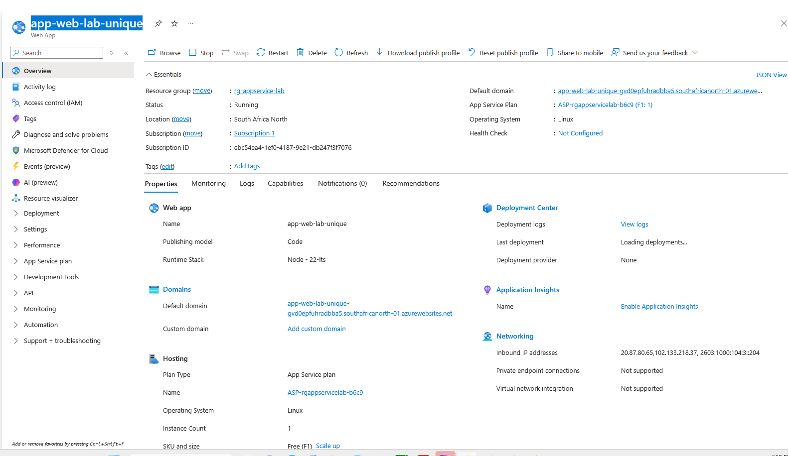

The screenshot above documents the App Service creation and its primary configuration.

---

# 5. App Service Plan

An **App Service Plan** defines the compute resources, pricing tier, and certain capabilities available to App Services.

The App Service created in this lab uses:

```text
ASP-rgappservicelab-b6c9
```

The plan is configured as:

```text
Operating System: Linux
Region: South Africa North
Pricing Tier: Free F1
Memory: 1 GB
```

### Evidence — App Service Plan

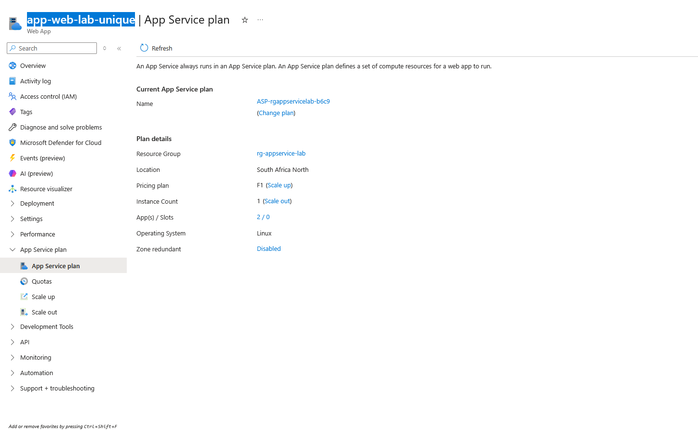

## App Service vs App Service Plan

This distinction is one of the most important concepts in this lab.

### App Service

The **App Service** represents the web application.

Example:

```text
app-web-lab-unique
```

### App Service Plan

The **App Service Plan** provides the compute environment in which the application runs.

Example:

```text
ASP-rgappservicelab-b6c9
```

The relationship can be visualized as:

```text
             App Service Plan
                    |
        +-----------+-----------+
        |                       |
        v                       v
     Web App A               Web App B
```

Multiple App Services can run inside the same App Service Plan and share the compute resources provided by that plan.

Therefore, creating three App Services in the same App Service Plan does not automatically mean Azure creates three completely separate compute infrastructures.

---

# 6. Why Code Instead of Docker Container?

The deployment method selected was:

```text
Publish: Code
```

This was selected because the application is a normal Node.js application.

The application consists primarily of:

```text
package.json
server.js
```

With Code deployment:

```text
Application Code
       |
       v
Azure App Service
       |
       v
Node.js Runtime
```

Azure provides the runtime environment while the application provides the source code.

With Docker Container deployment, the application and its runtime environment would instead be packaged into a container image.

Conceptually:

```text
Code Deployment

Azure
 |
 +-- Linux environment
 +-- Node.js runtime
 |
 +-- Application code
```

versus:

```text
Docker Deployment

Container Image
 |
 +-- Application
 +-- Dependencies
 +-- Runtime
 |
 +-- Container
```

---

# 7. Why Linux?

Linux was selected as the operating system.

Node.js applications can run effectively on Linux, and Azure App Service provides a managed Linux application hosting environment.

It is important to understand that this is not the same as creating and administering an Ubuntu Virtual Machine.

With a Virtual Machine:

```text
User
 |
 +-- VM
     |
     +-- Operating System
     +-- Updates
     +-- Services
     +-- Configuration
     +-- Administration
```

With App Service:

```text
User
 |
 +-- Application
 +-- App Service configuration

Azure
 |
 +-- Operating environment
 +-- Infrastructure
 +-- Platform management
```

App Service therefore provides a higher level of abstraction than an Azure Virtual Machine.

---

# 8. Runtime Configuration

The App Service was configured to use:

```text
Operating System: Linux
Runtime: Node.js
Version: 22 LTS
```

### Evidence — Runtime Configuration

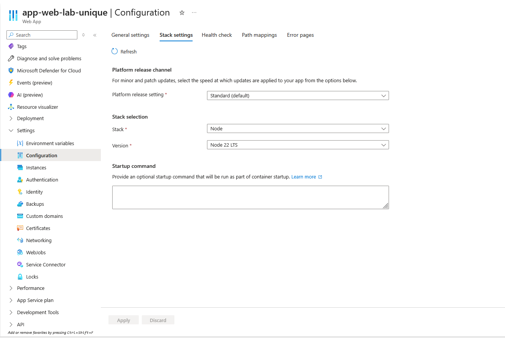

This screenshot documents the Linux operating system and Node.js runtime configuration.

---

# 9. Application Deployment

The Node.js application was packaged into a ZIP file before deployment.

The ZIP structure was:

```text
app.zip
 |
 +-- package.json
 |
 +-- server.js
```

The application files were placed at the root of the ZIP archive.

This is important because Azure needs to locate the application files correctly during deployment.

The application was successfully deployed to:

```text
app-web-lab-unique
```

### Evidence — Application Deployment

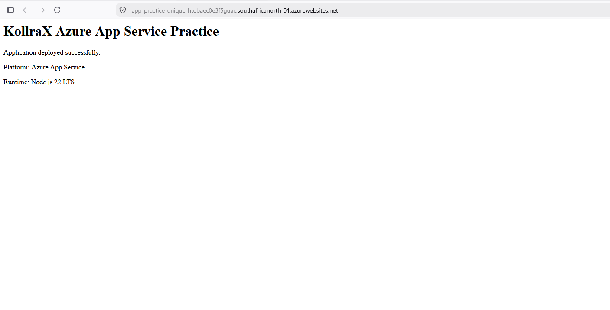

The screenshot demonstrates the deployed application running through Azure App Service.

---

# 10. Application Code

The Node.js application was configured to listen on the port provided by the hosting environment.

The important configuration was:

```javascript
const hostname = "0.0.0.0";
const port = process.env.PORT || 8080;
```

The application also contains an HTTP server that returns a response to incoming requests.

---

# 11. Why `process.env.PORT`?

The application uses:

```javascript
const port = process.env.PORT || 8080;
```

This means:

```text
Does the environment provide PORT?
          |
       YES
          |
          v
    Use PORT value

          |
         NO
          |
          v
    Use port 8080
```

The application therefore does not assume that it must always listen directly on port 80.

Port 80 is the standard HTTP port, but the application process can listen on another port inside the hosting environment.

Azure App Service handles the external web traffic and routes it to the application process.

---

# 12. Why `0.0.0.0`?

The application uses:

```javascript
const hostname = "0.0.0.0";
```

This tells Node.js to listen on all available network interfaces.

This is important in a cloud hosting environment because the application must be reachable through the App Service networking environment.

Conceptually:

```text
Internet
   |
   v
Azure App Service
   |
   v
Application Network Interface
   |
   v
0.0.0.0
   |
   v
Node.js Application
```

Using:

```text
127.0.0.1
```

would restrict the application to the local loopback interface.

---

# 13. package.json and Application Startup

The application used a startup script similar to:

```json
{
  "name": "kollrax-azure-app-service-lab",
  "version": "1.0.0",
  "description": "KollraX Azure App Service Lab",
  "main": "server.js",
  "scripts": {
    "start": "node server.js"
  }
}
```

The important section is:

```json
"start": "node server.js"
```

Therefore:

```text
npm start
    |
    v
package.json
    |
    v
node server.js
    |
    v
Application starts
```

---

# 14. Scaling

Azure App Service provides two major scaling concepts:

- Scale Up
- Scale Out

## 14.1 Scale Up

**Scale Up** means increasing the capacity of the App Service Plan.

This can involve moving to a higher pricing tier that provides additional:

- CPU
- Memory
- Storage
- Features
- Networking capabilities

Conceptually:

```text
Small Capacity
      |
      | Scale Up
      v
Larger Capacity
```

### Evidence — Scale Up

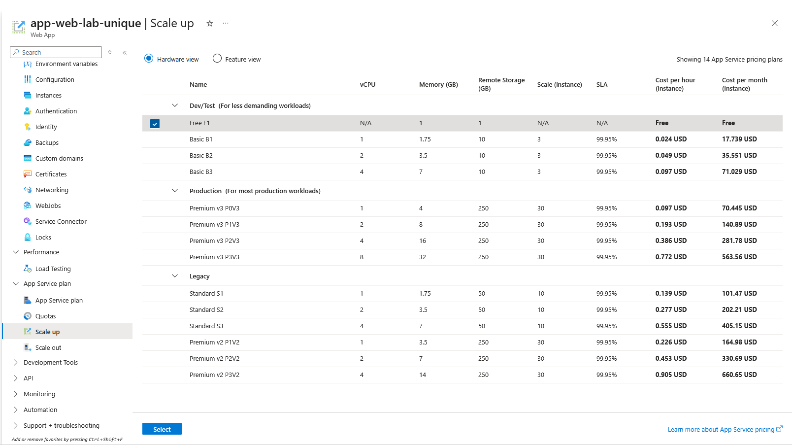

The screenshot documents the available App Service Plan scaling options.

## 14.2 Scale Out

**Scale Out** means increasing the number of application instances.

Conceptually:

```text
             App Service
                  |
       +----------+----------+
       |          |          |
       v          v          v
   Instance 1  Instance 2  Instance 3
```

Instead of making one instance more powerful, additional instances are added.

### Evidence — Scale Out

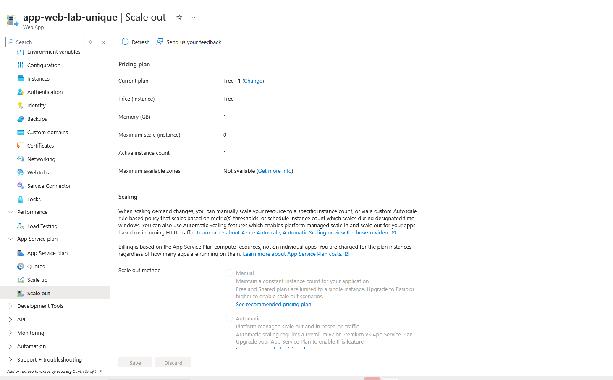

The Free F1 tier has limitations compared with higher App Service tiers.

---

# 15. Networking Configuration

The App Service networking configuration was inspected through the Azure Portal.

The configuration showed:

```text
Public Network Access
Enabled with no access restrictions
```

The Free tier also showed limitations around advanced networking capabilities.

For example:

```text
Private Endpoints
Not supported
```

and:

```text
Virtual Network Integration
Not supported
```

### Evidence — Networking Configuration

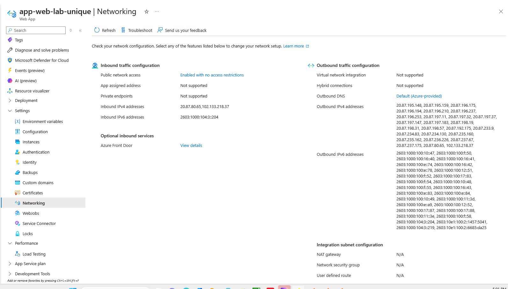

This screenshot documents the inbound and outbound networking configuration of the App Service.

---

# 16. Understanding Inbound and Outbound Traffic

The App Service networking page separates traffic into two major directions.

## Inbound Traffic

Inbound traffic is traffic coming into the application.

```text
Internet
   |
   | HTTPS
   v
App Service
```

## Outbound Traffic

Outbound traffic is traffic leaving the application.

```text
App Service
    |
    | HTTPS/API request
    v
External Service
```

Understanding both directions is important when troubleshooting application connectivity.

---

# 17. TLS Configuration

The App Service was configured with:

```text
Minimum Inbound TLS Version
1.2
```

The SCM endpoint was also configured with:

```text
SCM Minimum Inbound TLS Version
1.2
```

### Evidence — TLS Configuration

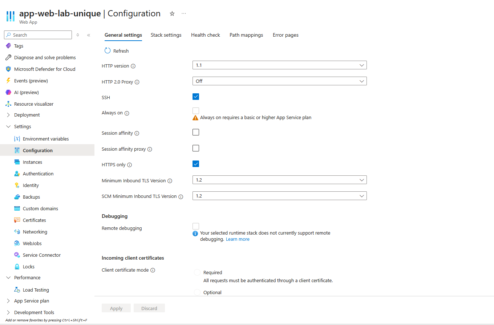

This configuration helps prevent clients from connecting using outdated TLS versions.

Conceptually:

```text
Client
   |
   | TLS 1.2+
   v
Azure App Service
```

TLS provides encryption for network communication.

---

# 18. Application Logs

Azure App Service provides **Log Stream** for viewing application and platform output in near real time.

Log Stream was used to observe the startup process of the Node.js application.

### Evidence — Application Logs

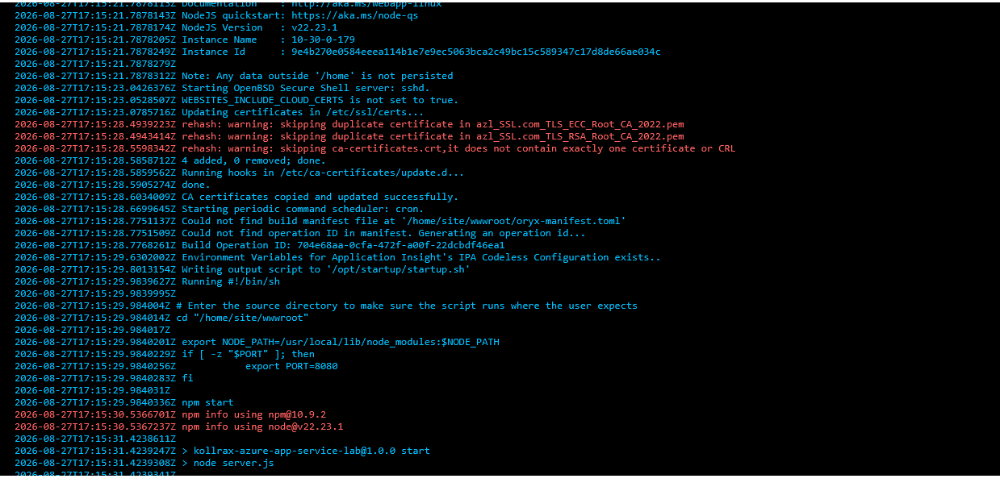

The logs showed:

```text
A P P   S E R V I C E   O N   L I N U X
```

This confirmed that the application was running in the Linux App Service environment.

The runtime information showed:

```text
NodeJS Version : v22.23.1
```

The startup environment then configured the application port:

```text
export PORT=8080
```

Azure then executed:

```text
npm start
```

The `package.json` startup script resulted in:

```text
node server.js
```

Finally, the application reported:

```text
Server listening on port 8080
```

The startup flow was therefore:

```text
Azure App Service
       |
       v
Linux Environment
       |
       v
Node.js 22.23.1
       |
       v
PORT = 8080
       |
       v
npm start
       |
       v
node server.js
       |
       v
Server listening on port 8080
```

---

# 19. Understanding Log Stream

Log Stream is essentially a live view of messages generated by the App Service environment and application.

Logs can help identify problems such as:

- Application startup failures
- Missing files
- Dependency errors
- Configuration errors
- Runtime errors
- Port problems
- Database connection failures

For example:

```text
Error: Cannot find module
```

could indicate that the application cannot locate a required module.

Therefore:

> **Logs tell us what happened.**

---

# 20. Metrics

Azure App Service also provides monitoring metrics.

Metrics are numerical measurements of application or platform activity.

Examples include:

- Requests
- CPU usage
- Memory usage
- HTTP responses
- Data in
- Data out

### Evidence — App Service Metrics

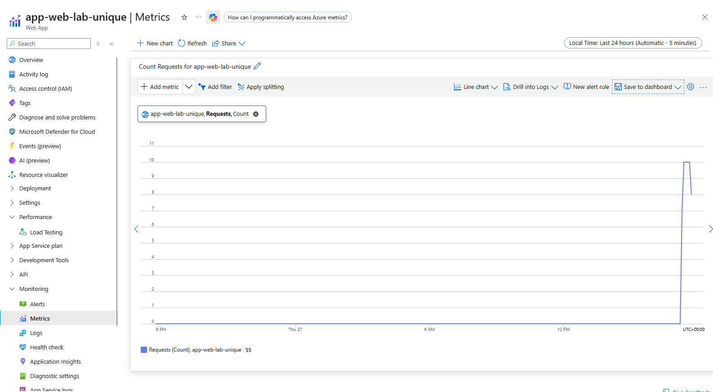

The distinction between logs and metrics can be summarized as:

```text
LOGS
"What happened?"

Example:
Server listening on port 8080
```

versus:

```text
METRICS
"How much or how often?"

Example:
Requests = 25
```

Metrics are useful for identifying workload patterns and monitoring application behavior.

---

# 21. Azure CLI Validation

The App Service was also validated using Azure CLI.

This demonstrates that Azure resources can be inspected and managed through the command line in addition to the Azure Portal.

## 21.1 Validate the App Service

The following command was used:

```bash
az webapp show \
  --resource-group rg-appservice-lab \
  --name app-web-lab-unique \
  --query "{Name:name, State:state, Location:location, Hostname:defaultHostName, ResourceGroup:resourceGroup}" \
  --output table
```

The `--query` parameter was used to select only the required properties.

The command can return information such as:

```text
Name
State
Location
Hostname
ResourceGroup
```

## 21.2 Validate the Node.js Runtime

The runtime was checked using:

```bash
az webapp config show \
  --resource-group rg-appservice-lab \
  --name app-web-lab-unique \
  --query linuxFxVersion \
  --output tsv
```

This command was used to verify the configured runtime.

The expected configuration is Node.js 22 LTS.

## 21.3 Validate TLS

The minimum TLS version was checked using:

```bash
az webapp config show \
  --resource-group rg-appservice-lab \
  --name app-web-lab-unique \
  --query minTlsVersion \
  --output tsv
```

The expected result was:

```text
1.2
```

### Evidence — Azure CLI Validation

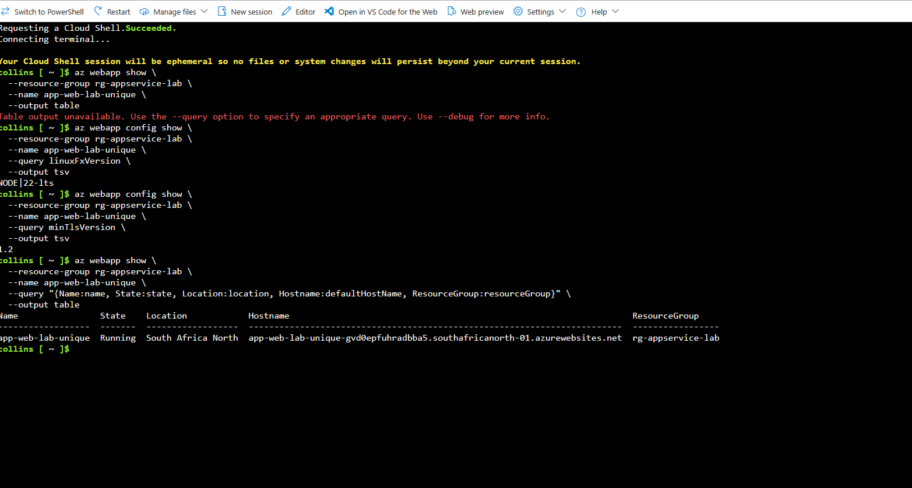

This screenshot provides command-line evidence that the App Service configuration can be inspected outside the Azure Portal.

---

# 22. Troubleshooting Lessons

Several troubleshooting lessons were demonstrated during this lab.

## 22.1 ZIP Deployment Structure

The application files must be packaged correctly.

Correct:

```text
app.zip
 |
 +-- package.json
 +-- server.js
```

Incorrect:

```text
app.zip
 |
 +-- application-folder
      |
      +-- package.json
      +-- server.js
```

when the deployment process expects the application files at the root.

## 22.2 Application Port

The application should not assume that it will always receive port 80.

Instead:

```javascript
const port = process.env.PORT || 8080;
```

allows the hosting environment to provide the required port.

## 22.3 Application Binding

The application uses:

```javascript
const hostname = "0.0.0.0";
```

so that it listens on all available network interfaces.

## 22.4 Log Stream

When an application fails to start, Log Stream is an important troubleshooting resource.

It can reveal:

```text
Startup errors
Dependency errors
Configuration errors
Runtime errors
Port problems
Missing files
```

---

# 23. Important Concepts Learned

## App Service

A managed Azure platform for hosting web applications, APIs, and backend services.

## App Service Plan

Defines the compute resources, pricing tier, and capabilities available to App Services.

## Code Deployment

Azure provides the runtime environment while the application provides the source code.

## Linux App Service

Provides a managed Linux-based application hosting environment.

## Scale Up

Increase the capacity of the App Service Plan.

## Scale Out

Increase the number of application instances.

## Log Stream

Provides near real-time visibility into application and platform output.

## Metrics

Provides numerical monitoring information about application or platform activity.

## TLS

Provides encrypted network communication.

## Azure CLI

Provides command-line administration and validation of Azure resources.

---

# 24. Final Architecture

```text
                         INTERNET
                            |
                            | HTTPS
                            v
                  +---------------------+
                  |   Azure App Service  |
                  |                     |
                  | app-web-lab-unique  |
                  |                     |
                  | Linux               |
                  | Node.js 22 LTS      |
                  +----------+----------+
                             |
                             |
                        PORT = 8080
                             |
                             v
                    +----------------+
                    |   server.js    |
                    |                |
                    | Node.js App    |
                    +----------------+
                             |
                             v
                       HTTP Response


                 COMPUTE PROVIDED BY
                         |
                         v
              +-----------------------+
              |   App Service Plan    |
              |                       |
              | ASP-rgappservicelab-  |
              | b6c9                  |
              |                       |
              | Free F1               |
              +-----------------------+
```

---

# 25. Lab Outcome

The lab successfully demonstrated the deployment and management of a Node.js web application using Azure App Service.

The key mental model developed during this lab is:

```text
                 APP SERVICE
                      |
              Hosts the application
                      |
                      v
                 server.js
                      |
                      v
                 Node.js 22
                      |
                      v
                 PORT 8080


              APP SERVICE PLAN
                      |
              Provides compute
                      |
                      v
                 Free F1
                      |
                      v
              Linux Environment
```

The lab also demonstrated that Azure resources can be managed through multiple interfaces:

```text
                 Azure Resource
                       |
              +--------+--------+
              |                 |
              v                 v
        Azure Portal       Azure CLI
              |                 |
              v                 v
             GUI            Commands
```

---

# 26. Future App Service Labs

The following topics can be explored in future App Service exercises:

- Deployment Slots
- Custom Domains
- Managed Identities
- Azure Key Vault Integration
- Application Insights
- Virtual Network Integration
- Private Endpoints
- Autoscaling
- CI/CD Deployment
- App Service Authentication
- App Service Security
- GitHub Actions deployment
- Azure DevOps deployment

---

# 27. Skills Demonstrated

This lab demonstrates practical experience with:

- Azure App Service
- App Service Plans
- Linux application hosting
- Node.js
- Application deployment
- ZIP deployment
- Application networking
- Ports and bindings
- TLS configuration
- Scaling concepts
- Application logging
- Monitoring metrics
- Azure Portal
- Azure CLI
- Cloud troubleshooting

---

# Lab Status

**COMPLETED**

### Application

```text
app-web-lab-unique
```

### Resource Group

```text
rg-appservice-lab
```

### Region

```text
South Africa North
```

### Runtime

```text
Node.js 22 LTS
```

### Operating System

```text
Linux
```

### Pricing Tier

```text
Free F1
```

### Minimum TLS

```text
1.2
```

### Deployment

```text
Successful
```

---

# Repository Structure

```text
lab-03-app-service/
│
├── README.md
│
└── diagrams/
    │
    ├── 01-app-service-overview.png
    ├── 02-app-service-plan.png
    ├── 03-app-service-deployment.png
    ├── 04-app-service-runtime.png
    ├── 05-app-service-scale-out.png
    ├── 05-app-service-scale-up.png
    ├── 06-app-service-networking.png
    ├── 07-app-service-tls.png
    ├── 08-app-service-logs.png
    ├── 09-app-service-metrics.png
    └── 10-app-service-cli-validation.png
```

---

# Conclusion

This lab provided practical experience deploying a Node.js application to Azure App Service and understanding the platform from both an application and infrastructure perspective.

The most important lessons were:

1. **An App Service hosts the application.**
2. **An App Service Plan provides the compute resources.**
3. **Code deployment allows Azure to provide the application runtime.**
4. **Linux provides the managed operating environment.**
5. **`process.env.PORT` allows the application to use the port supplied by the hosting environment.**
6. **`0.0.0.0` allows the application to listen on all network interfaces.**
7. **Scale Up increases capacity.**
8. **Scale Out increases instances.**
9. **Log Stream helps determine what happened inside the application environment.**
10. **Metrics help measure application behavior and workload.**
11. **TLS 1.2 provides secure network communication.**
12. **Azure CLI provides an alternative method for managing and validating Azure resources.**

